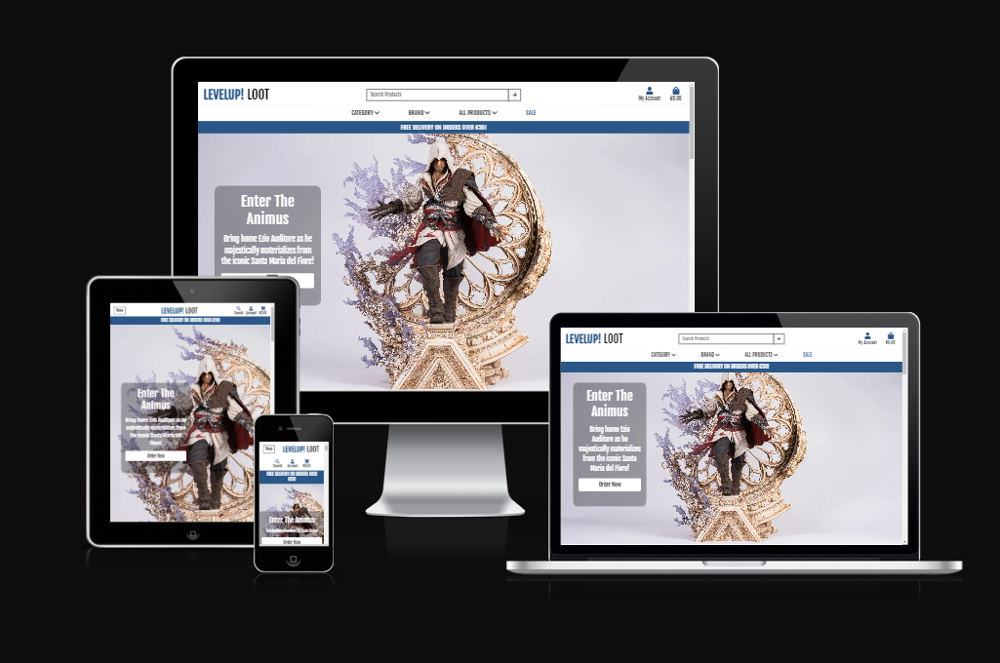
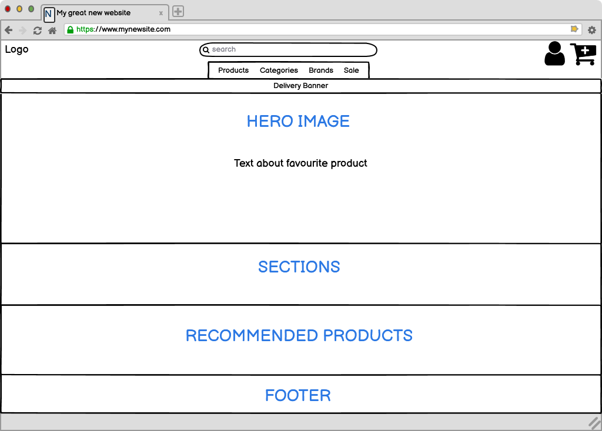
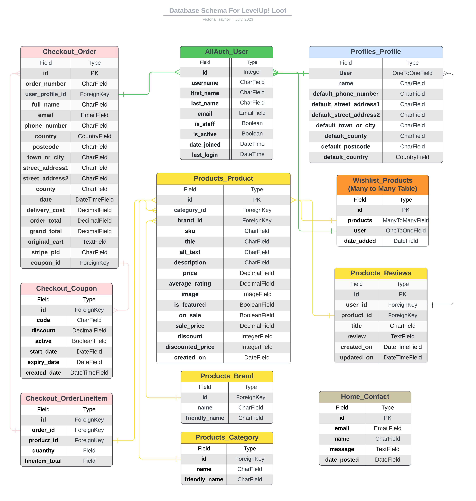
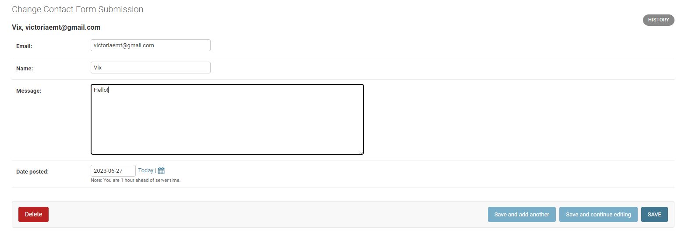
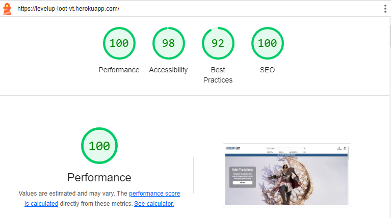
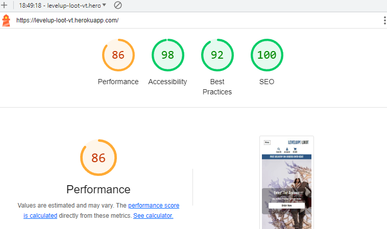
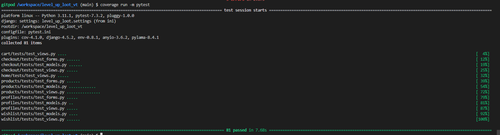

# LevelUp! Loot

Welcome to LevelUp! Loot. This website was built using Django, with custom Python, HTML and CSS for Code Institute P5 E-commerce Applications. This website is a B2C e-commerce application that allows users to purchase premium and exclusive collectible figures from across the realm of Pop Culture - including gaming, anime, TV show and movies.

The site has some features available exclusively to registered users, including viewing their order history, saving items to a wishlist and add product reviews.

Users have the ability to search products and view product details, add products to a cart and checkout. There is also a contact page for queries, a privacy policy and a page of FAQs.

[Live link to LevelUp! Loot](https://levelup-loot-vt.herokuapp.com/)

 

# Table of Contents

1. [UX](#ux)
  
2. [The Strategy Plane](#the-strategy-plane)
    * [Targeted Users](#targeted-users)
    * [Site Goals](#site-goals)
    * [Project Goals](#project-goals)
3. [Agile Planning](#agile-planning)
    * [User Stories](#user-stories)
    * [Epic Breakdowns](#epic-breakdowns)
4. [Skeleton Plane](#skeleton-plane)
    * [Wireframes](#wireframes)
5. [The Scope Plane](#the-scope-plane)
6. [The Structure Plane](#the-structure-plane)
    * [Features](#features)
    * [Home Page](#home-page)
      * [Wellness Section](#wellness-section)
      * [Benefits Section](#benefits-section)
      * [Instructors Section](#instructors-section)
    * [About Page](#about-page)
    * [Contact Page](#contact-page)
    * [Pages Restricted to Login](#restricted-pages)
      * [Booking](#booking-page)
      * [My Profile](#profile-page)
      * [Register](#register-page)
      * [Log Out](#log-out-page)
      * [Admin Page](#admin-page)
    * [Future Features](#future-features)
7. [The Surface Plane](#the-surface-plane)
    * [Design](#design)
      * [Colour Scheme](#colour-scheme)
      * [Typography](#typography)
      * [Images](#images)
8. [Technologies](#technologies)
    * [Languages Used](#languages-used)
    * [Libraries And Frameworks](#libraries-and-frameworks)
    * [Tools and Resources](#tools-and-resources)
9. [Testing](#testing)
    * [Validator Testing](#validator-testing)
    * [Other Testing](#other-testing)
10. [Bugs Found and Fixed](#bugs-found-and-fixed)
    * [Bugs Not Fixed](#bugs-not-fixed)
11. [Credits And Sources](#credits-and-sources)
12. [Deployment](#deployment)
13. [Acknowledgements](#acknowledgements)

 

# UX

## The Strategy Plane

### Targeted Users

- A user that wants to view and buy collectible statues.
- A user that wants to see the latest statues released from major brands.
- A user that is interested in all things Pop Culture.

### Site Goals

- For users to be able to search products quickly and easily.
- For users to be able to purchase products quickly and easily.
- For users to be able to create an account to store their Wishlist and see their order history.
- For users to be able to edit their saved address for easier purchasing.
- For users to be able to contact the business online.

### Project Goals

- Create a fully working e-commerce application that would look and feel like a professionally designed online store. Taking all of my knowledge from the 4 projects before, I wasnted this website to be as comprehensive and complete as I could possibly make it.
- In my previous projects, I had yet to write anything like a wishlist or user reviews so these were something I wanted to incorporate to further expand my knowledge of CRUD functionality.

 

[Back to Top](#table-of-contents)

 

## **Agile Planning**

My Project was developed with agile planning. This meant that each individual feature was split first into User Stories for what the user of the website would expect. Each User Story was thought about and planned out, which allowed me to create multiple tasks which would be developed to implement certain features and these Tasks were then grouped together into Epics.

Everything was labeled as Must Have, Should Have, Could Have and Won't Have to help prioritise which were most important to implement.

As the main priority of the website, the products section was started first and given the most time for completion. After that, as the project evolved, some more tasks were added or updated, based on the changing needs of a User within the website.

The Project board can be found [here](https://github.com/users/VictoriaT87/projects/6/views/1?visibleFields=%5B%22Title%22%2C%22Assignees%22%2C%22Status%22%2C%22Labels%22%5D).

[Back to Top](#table-of-contents)

 

## User Stories

* Users will:

  * Have the ability to view and purchase products quickly and easily.
  * Be able to use the website across all devices with responsive design.
  * Be able to create an account, update their profile information, leave reviews and create a wishlist.

* Users expect:

  * An easy to use e-commerce store, with purchasing of products going smoothly.
  * A website that looks well across all devices.
  * A website that works well, with minimum errors encountered.

 

[Back to Top](#table-of-contents)

 

## Epic Breakdowns
## **Epic 1: [Initial Install](https://github.com/VictoriaT87/level_up_loot_vt/issues/1)**
> Create the base Django application on which to build the project.

Broken down into these tasks:
- **Task: [Install Libraries and Frameworks](https://github.com/VictoriaT87/level_up_loot_vt/issues/10)**
>Install: Django, gunicorn, dj-database, psycopg2
- **Task: [Hide sensitive information](https://github.com/VictoriaT87/level_up_loot_vt/issues/11)**
> Hide sensitive information by creating an env.py file
- **Task: [Create Products app](https://github.com/VictoriaT87/level_up_loot_vt/issues/12)**
>  Create a products app to install the fixtures file
- **Task: [Create Fixtures File](https://github.com/VictoriaT87/level_up_loot_vt/issues/46)**
>  Create custom fixtures file for adding products

This Epic was the inital install of Django, gunicorn, dj-database and psycopg2 and the Products app. The custom fixtures file needed to add products into the store was then installed into this app. This was the base platform on which the entire website would be built.

[Back to Top](#table-of-contents)

 

---

 

## **Epic 2: [Initial Deployment](https://github.com/VictoriaT87/level_up_loot_vt/issues/2)**
> First deployment to the Heroku app once basic framework for the project is in place

Broken down into these tasks:
- **Task: [Heroku Deployment](https://github.com/VictoriaT87/level_up_loot_vt/issues/13)**
> Create App in Heroku, Create Config Var files, Deploy from main branch
- **Task: [ElephantSQL Set up](https://github.com/VictoriaT87/level_up_loot_vt/issues/14)**
>  Create Database URL in Elephant SQL, Add the Database URL to env.py and Heroku Config Vars

This Epic was for the inital deployment of the website to Heroku. This was undertaken as soon as the base packages, App and env.py file was set up and working correctly. Config Var files were created on Heroku for any sensitive information contained in the env.py file, as well as Port access needed.

[Back to Top](#table-of-contents)

 

---

 

## **Epic 3: [Databases](https://github.com/VictoriaT87/level_up_loot_vt/issues/3)**
> Create database models in project app and migrate them

Broken down into the following task:
- **Task: [Create and Migrate Database](https://github.com/VictoriaT87/level_up_loot_vt/issues/15)**
> Create and Migrate Database of products

The initial database was created for the products app and the installed products from the fixtures file. The database is hosted on ElephantSQL, so a project was started there to host it.

[Back to Top](#table-of-contents)

 

---

 

## **Epic 4: [Admin Panel](https://github.com/VictoriaT87/level_up_loot_vt/issues/4)**
> Add an admin panel to the project app to allow the admin to manage products

This was from the User Story:
#### **User Story: [Admin Panel](https://github.com/VictoriaT87/level_up_loot_vt/issues/16)**
> As a Site Admin I can use an admin panel so that I can create, update, manage and delete products and orders

The Admin panel allows the site admin to manage products - add, delete, update, set them to be on sale with discount prices or have them featured on the homepage. The admin panel also stores all contact form submissions and user profiles. All information for these can be seen, updated and removed from the database through the admin panel. Each App's admin.py file was also given some sort of display or search parameter, to make it easier for the site admin to find and sort information on the backend. 

[Back to Top](#table-of-contents)

 

---

## **Epic 5: [User Profiles](https://github.com/VictoriaT87/level_up_loot_vt/issues/5)**
> Allow Users to create/update/manage and delete user profiles

This was from the User Story:
#### **User Story: [Create a Profile](https://github.com/VictoriaT87/level_up_loot_vt/issues/17)**
> As a Site User I can create an account so that I can save my information for easier repeat purchases and to view my order history

Which was down broken down into these tasks:
- **Task: [Create Account](https://github.com/VictoriaT87/level_up_loot_vt/issues/18)**
> As a Site User I can create an account so that I can save my information for easier repeat purchases and to view my order history
- **Task: [Update Account](https://github.com/VictoriaT87/level_up_loot_vt/issues/19)**
> Allow a user to update all their profile information within their account and update database accordingly
- **Task: [Delete Account](https://github.com/VictoriaT87/level_up_loot_vt/issues/20)**
> Allow a user to delete their account, add authorisation so this isn't done by accident

 

This User Story was implemented with the use of the AllAuth package, as well as a Profile Model, Form and Template. The information the user enters in this is stored in the Admin panel, for SuperUsers/Staff to see and manage. Each User is assigned a User ID which allows for orders to be assigned properly to each individual. Users can edit their profiles and delete them and this is all reflected in the database.

[Back to Top](#table-of-contents)

 

---

 

## **Epic 6: [Adding Products to Cart](https://github.com/VictoriaT87/level_up_loot_vt/issues/6)**

> Create an app to allow users to view products and add them to a cart

This was from these User Stories:
#### **User Story: [View Products](https://github.com/VictoriaT87/level_up_loot_vt/issues/37)**
> As a user I can view products so that I can decide which items I want to purchase

#### **User Story: [Search Products](https://github.com/VictoriaT87/level_up_loot_vt/issues/38)**
> As a user I can search all products and view categories so that I can see only the products I'm interested in

#### **User Story: [View Product Details](https://github.com/VictoriaT87/level_up_loot_vt/issues/39)**
> As a user I can view individual product details so that I can identify the price, description, rating, image and price.

#### **User Story: [Identify Deals](https://github.com/VictoriaT87/level_up_loot_vt/issues/40)**
> As a user I can easily view deals and sales so that I can take advantage of savings on products I want to purchase

Which was down broken down into these tasks:
- **Task: [Create Products app](https://github.com/VictoriaT87/level_up_loot_vt/issues/12)**
>  Create a products app to install the fixtures file
- **Task: [Manage Products](https://github.com/VictoriaT87/level_up_loot_vt/issues/23)**
> Allow admins/superusers to add products to the store through the frontend or admin panel
- **Task: [Add/View Products](https://github.com/VictoriaT87/level_up_loot_vt/issues/24)**
> Create a Product app which will show all available products, with prices and ratings.
- **Task: [Update/Delete Products](https://github.com/VictoriaT87/level_up_loot_vt/issues/25)**
> Allow Site Admins to update and delete products available on the site
- **Task: [Add Sale Feature](https://github.com/VictoriaT87/level_up_loot_vt/issues/47)**
> Add the ability for an admin/superuser to add products to a sale list, with calculated discount, for users to view

These User Stories are the basis of the website. This adds the product app which allows Admins/Superusers to add products to the store, update or delete them, and publish them for Site Users to view. It also adds the Sale section which will allow Users to quickly view products that are on sale, which will entice more sales for discount prices. All products can be managed on both the frontend and the admin section, with everything reflected in the database.

[Back to Top](#table-of-contents)

 

---

 

## **Epic 7: [Purchasing Items](https://github.com/VictoriaT87/level_up_loot_vt/issues/7)**

> Allow users to purchase items in their cart

This was from these User Stories:
#### **User Story: [View Total Spending](https://github.com/VictoriaT87/level_up_loot_vt/issues/41)**
As a user I can easily see how much my total purchase will be so that I can avoid spending too much

#### **User Story: [View Items in Cart](https://github.com/VictoriaT87/level_up_loot_vt/issues/43)**
As a user I can view items in my bag to be purchased so that I can identify the total cost of my purchase and all the items I will receive

#### **User Story: [Safe and Secure Payment](https://github.com/VictoriaT87/level_up_loot_vt/issues/42)**
As a user I can feel that my payment is safe and secure so that I can confidently provide the needed information to make a purchase

Which was down broken down into these tasks:
- **Task: [Create Cart App](https://github.com/VictoriaT87/level_up_loot_vt/issues/48)**
> Create a cart app which will allow site users to view their cart, update it as they wish and see their current subtotal
- **Task: [Set up Stripe Payments](https://github.com/VictoriaT87/level_up_loot_vt/issues/49)**
> Set up webhooks to connect and allow Stripe payments on the website

This Epic was the breakdown of User Stories that will allow Site Users to add products to a cart, view the subtotals and checkout securely. Stripe was used for the Webhooks to handle payments. 

[Back to Top](#table-of-contents)

 

---

 

## **Epic 8: [Front End Design](https://github.com/VictoriaT87/level_up_loot_vt/issues/8)**

>Create templates, a colour scheme, navigation and responsiveness for the website

This was from the User Story:
#### **User Story: [Responsive Design](https://github.com/VictoriaT87/level_up_loot_vt/issues/21)**
> As a Site User I expect responsive elements so that I can view the website across multiple devices

Which was down broken down into these tasks:
- **Task: [Create Templates](https://github.com/VictoriaT87/level_up_loot_vt/issues/26)**
> Create templates for each page needed within the site, including the home page, a booking page, a login/create account page and pages for further information.
- **Task: [UI Design](https://github.com/VictoriaT87/level_up_loot_vt/issues/27)**
> Design a website fitting of the theme with appropriate colours, easy to navigate, easily accessible information and has full screen reader capabilities.

One of the most important parts of a website, the look and layout bring out emotions in the user. The website needs to be easy to navigate, while not feeling too cluttered with the many options for products to buy. The responsiveness of the website has been extensively tested, as documented in the testing section.

[Back to Top](#table-of-contents)

 

---

 

## **Epic 9: [Error Pages](https://github.com/VictoriaT87/level_up_loot_vt/issues/9)**

> Create custom error page templates for 404, 403 and 500 errors.

This was from the User Story:
#### **User Story: [Error Pages](https://github.com/VictoriaT87/level_up_loot_vt/issues/50)**
> As a user I can see custom error pages so that I can see exactly what my issue was and report it to the site admin if needed

Which was down broken down into these tasks:
- **Task: [404 Error Page](https://github.com/VictoriaT87/level_up_loot_vt/issues/29)**
> Add a custom 404 Page to show the user which error they encountered while keeping the base template and css of the website.
- **Task: [403 Error Page](https://github.com/VictoriaT87/level_up_loot_vt/issues/30)**
> Add a custom 403 Page to show the user which error they encountered while keeping the base template and css of the website.
- **Task: [500 Error Page](https://github.com/VictoriaT87/level_up_loot_vt/issues/31)**
> Add a custom 500 Page to show the user which error they encountered while keeping the base template and css of the website.

Creating custom error page templates makes the website feel more fleshed out. Before their implementation, they were provided as a basic white page with black text. Hopefully the user never sees these pages but in the event that they do, it's important that the page still looks individual to the website.

[Back to Top](#table-of-contents)

 

---

 

## **Epic 10: [Create Documentation](https://github.com/VictoriaT87/level_up_loot_vt/issues/51)**

>Create both a README.md file and a Testing.md file to show the process of creating the project

Which was down broken down into these tasks:
- **Task: [Create README.md](https://github.com/VictoriaT87/level_up_loot_vt/issues/34)**
> Create an app inside the Django project to allow users to book a yoga session
- **Task: [Create Testing.md](https://github.com/VictoriaT87/level_up_loot_vt/issues/35)**
> Create a full Testing.md document with all necessary information on how the project was manually/automatically tested.

Document everything needed for the process of developing and testing the website.

[Back to Top](#table-of-contents)

 

---

#### **Others**
- **Task: [Testing](https://github.com/VictoriaT87/level_up_loot_vt/issues/52)**
> Create manual and/or automated tests for a Full-Stack Web application using an MVC framework and related contemporary technologies

Automatic tests were written using TestCase from Django, as well as manual testing of code and resposivness. Covered in the Testing section.

- **Task: [Allow Email and Password Changing](https://github.com/VictoriaT87/level_up_loot_vt/issues/28)**
> Allow the User to reset both their passwords and their email addresses if they've forgotten either.

This is all handled through the AllAuth authentication system. Users who have forgotten their password have the option to have it emailed to them.

- **User Story: [Wishlists](https://github.com/VictoriaT87/level_up_loot_vt/issues/44)**
> As a user I can add products to a wishlist so that I can easily see which items I would like to buy eventually
- **Task: [Wishlist](https://github.com/VictoriaT87/level_up_loot_vt/issues/45)**
> Add an app with views/models/URLs to allow users to store a wishlist of products

These 2 tasks were added on later in the planning when I realised that the majority of e-commerce stores have some sort of wishlist/favourites section and as a user of those sites myself, I find this function very useful. Instead of having to return to the "All Products" section to find a certain product, allowing users to store their favourites in one place will make it more likely for them to return to purchase these items quickly.

 

[Back to Top](#table-of-contents)

 

## Skeleton Plane

### Wireframes

- My starting point for this project was to decide on a layout using a wireframe. I went for a Hero Image for the front page, to quickly show the user what the business was about at first view. The products page each has a card, showing all details quickly so users can easily see the product, the price and a quick description.

 

 

### Database Schema

- Both the AllAuth User and the Products Database are the main ones in the schema, connecting all products and profiles.
- The Products Database allows for a connection to the Checkout Databases, including the orders, order items and coupons.
- The Products Database also allows us to create a Wishlist for users. This is a ManyToMany database, which allows us to have 1 user wishlist as many products as they want.
- The Profile Database is separate from the User, so that users to the site don't need to have created an account to make an order but if they do, they can save their profile information for quicker checkout next time. 
- The Review Database is connected to the Profile Database - this means that registered users can leave a review for a product, as well as update and delete those reviews.
- The Contact Database is used purely for creating and storing Contact Form submissions on the admin panel for staff to view.

[Back to Top](#table-of-contents)

 

## The Scope Plane
- Home page with hero image that immediately tells the user what the site is for.
- Account registration which will allow for restricted viewing on Editing and Deleting pages and booking an appointment.
- Fully responsive website, tested across all screen sizes, with navigation for mobile.
- Ability to create, view, update and delete appointments.

 

[Back to Top](#table-of-contents)

 

## The Structure Plane

# Features 

## Existing Features

### Home Page

- The home page features a hero image, with some text explaining the main purpose of the website and a small image to compliment the text.
- The index page is split into multiple sections, with the information easy to read and eye catching to a visitor.
- Along with this is a link. This link will ask the visitor to create a profile to book an apppointment if they're not logged in. If they are a logged in user, this link will instead suggest they book an appointment.

 

[Back to Top](#table-of-contents)

 

### Wellness Section

- The Wellness section of the index page explains what the booked sessions entail in a quick to read paragraph.
- Under this, there are 2 cards, with images and text, with a quick explanation of what Yoga and Meditation are.

 

[Back to Top](#table-of-contents)

 

### Benefits Section

- The benefits section of the home page provides some information to the user about how a wellness session can benefit their health, as well as provding a colour break up between large text sections.

 

### Instructors Section

- The Instructors section allows users to get a more peronal feel for the business by introducing them to the people they would likely meet if they booked a session.
- Each of the 3 instructors has a card with their name, photo and an explanation of their expertise in Yoga and Meditiation.

 

[Back to Top](#table-of-contents)

 

### About Page

- The About page gives the user a chance to learn more about both the Manor Hosue where the sessions will take place and what each session will entail.
- Information about both Yoga and Meditation are also shown, with links to credited sources about each for users to research themselves. 

 

[Back to Top](#table-of-contents)

 

### Contact Page

- The contact page features small icons with quick and easy to read information with a phone number, address and email.
- The page also hold a form for users to get in contact with the business. This form stores the posted information in the Admin panel, for staff to read easily.
- There is also directions on how to get to LevelUp! Loot, as well as an embedded Google Map pointing to the business.

 

[Back to Top](#table-of-contents)

 

### Restricted Pages

- Some pages are restricted to logged in users only. Links to these pages are only show in the Navbar when a user logged in.

 

[Back to Top](#table-of-contents)

 

### Booking Page

- The Booking Page allows users to book an appointment, saved to their profile.
- Each day for the next 7 days has 4 appointments each to choose from.
- Booked appointments will show as buttons with the text "Booked" and those buttons will be disabled.
- Clicking a button to choose a timeslot will take you to a confirmation page. If a user doesn't want this time, they can return to the booking page and choose another or confirm the original appointment time shown.

 

[Back to Top](#table-of-contents)

 

### Profile Page

- The Profile page stores both the users information, as well as their appointments.
- The user can update their first name, last name and their booked appointments from here.

- Users can also delete their profile and their appointments from this page too. Each action has a confirmation tied to it.

- All of this is done with database information being created, read, updated and deleted (CRUD).

 

[Back to Top](#table-of-contents)

 

### Register Page

- The Register Page has a custom form, which asks users to provide a username, their full name and their email address and password.
- When these are entered, they're saved to a Profile database and the username, first name and last name all show on the Profile page of the logged in user.

 

[Back to Top](#table-of-contents)

 

### Log Out Page

- The log out page is another restricted page which asks the registered user to confirm they would like to log out of their account.

[Back to Top](#table-of-contents)

 

### Admin Page

- The admin dashboard is restricted to Super Users and anyone the Super User designates as staff. The dashboard is populated with the information from the Models in each app.
- The booked appointments for each user are shown, with their name, the date of the appointment, the time they have chosen and the date the user booked the appointment.

- The Profiles of each registered user is also posted here, with the username, first name and last name of the User saved.

- The Contact form submissions are saved to the admin panel. The name, email and message from the contact form is shown to the admin, to allow them to reply to the User easily.

[Back to Top](#table-of-contents)

 

## Future Features

- There are definitely some features I would like to include, including better options for a registered user. Currently there is no way to reset a password or change an email address. I tried to implement these using AllAuth however I couldn't get the email system to work. More information about that is provided in the [Bugs](#bugs) section.
- I originally wanted to add an blog to the website which would be updated with the latest information about the business and would also allow Staff to add blog posts with some Yoga videos and wellness information. The reason for not implementing them at the current time was purely down to time contraints on an already massive project.

 

[Back to Top](#table-of-contents)

## The Surface Plane
## Design
### Colour Scheme
 -   The colour scheme was important to the site and what the business offered. The setting of the Meditation and Yoga settings are outside in a manor garden and so it needed to be a mellow colour, something that showed relaxation and spiritualness. For this reason I decided on a green that was close to a forest green. I stuck with the green and white combination throughout the site. Some buttons are accentuated with a slightly darker green colouring. 

### Typography
 -   The font chosen for the website is a font called Raleway. This was picked because it looked like an elegant font, which fits well with the theme of the business and the expected users. I wanted the typography to compliment the website, not overpower what it was saying. The font was found on [Google Font](https://fonts.google.com/specimen/Raleway) and imported to the website with a CSS import.

### Images
- All images were chosen to compliment the project theme of relaxation, wellbeing and spiritualness. Images were all taken from [Pexels.com](https://www.pexels.com/).

 

[Back to Top](#table-of-contents)

 

# Technologies

## Languages Used
* [HTML5](https://en.wikipedia.org/wiki/HTML5)
* [CSS3](https://en.wikipedia.org/wiki/Cascading_Style_Sheets)
* [Javascript](https://en.wikipedia.org/wiki/JavaScript)
* [Python](https://en.wikipedia.org/wiki/Python_(programming_language))

## Frameworks Used

* [Django](https://www.djangoproject.com/)
* [Bootstrap](https://blog.getbootstrap.com/) 

## Libraries And Installed Packages

* [coverage](https://pypi.org/project/django-coverage/) - Used for running automated tests.
* [pytest](https://docs.pytest.org/en/7.2.x/) - Used for running automated tests.
* [pytest-cov](https://pypi.org/project/pytest-cov/) - Used for running automated tests.
* [crispy-bootstrap4](https://pypi.org/project/crispy-bootstrap4/) - Template pack used for django-crispy-forms
* [django-crispy-forms](https://pypi.org/project/crispy-bootstrap4/) - Used to render forms throughout the project.
* [dj-database-url](https://pypi.org/project/dj-database-url/) - A package used to utilize DATABASE_URL environment variable.
* [dj3-cloudinary-storage](https://pypi.org/project/dj3-cloudinary-storage/) - Facilitates integration with Cloudinary by implementing Django Storage API.  
* [django-allauth](https://django-allauth.readthedocs.io/en/latest/) - Allows authentication, registration and account management in Django.
* [gunicorn](https://gunicorn.org/) - A Python WSGI HTTP Server for UNIX.
* [psycopg2](https://pypi.org/project/psycopg2/) - A PostgreSQL database adapter.
* [Black](https://pypi.org/project/black/) - A Python code formatter.
* [django-bootstrap-datepicker-plus](https://pypi.org/project/django-bootstrap-datepicker-plus/) - A calendar widget with extra customization.
*[Css Minifier](https://www.toptal.com/developers/cssminifier) - Minify CSS for better response time.

 

[Back to Top](#table-of-contents)

 

## Tools And Resources
* [GitPod](https://www.gitpod.io/)
* [GitHub](https://github.com/)
* [Heroku](https://heroku.com)
* [ElephantSQL](https://www.elephantsql.com/)
* [Cloudinary](https://cloudinary.com/)
* [ReadMe Template](https://github.com/Code-Institute-Solutions/readme-template)
* [Stack Overflow](https://stackoverflow.com/)
* [Coolors](https://coolors.co/)
* [AmIResponsive](https://ui.dev/amiresponsive)
* [Real Python](https://realpython.com/)
* [Pexels](https://www.pexels.com/)
* [Online Convert](https://image.online-convert.com/convert-to-webp)
* [Pic Resize](https://picresize.com/)

 

[Back to Top](#table-of-contents)

 

# Testing 
### Validator Testing 

- HTML
  - No errors were returned when passing through the official [W3C validator](https://validator.w3.org/)
  - The only warnings that were given were because of the nature of Django Template Syntax.

- CSS
  - No errors were found when passing through the official [(Jigsaw) validator](https://jigsaw.w3.org/css-validator/)
- Python
  - No errors were returned when passing through [CI Python Linter](https://pep8ci.herokuapp.com/)

 

### Lighthouse Testing

  - Testing on Desktop has given a variety of scores, going from a score between 85 and 97 for Performance and a score between 83 to 92 for Best Practices. The last tests before submissions are posted below.
  - When tested on desktop, the website scores 95 on performance.
  - For a while, the best score I could achieve for Best Practices was only 83. The main reason for the lower score on Best Practices was because the Boostrap and jQuery files that are rendered logged an issue to the console which said "Audit usage of navigator...". As these were from CDN files, I was unable to fix this error manually. However upon further testing, this seems to have disappeared as an error.
  - The other reason was because 1 image (the hero image) doesn't have the correct aspect ratio but no matter which width and height I gave, it didn't fix the issue. I assume this is because it's rendered with a border-radius. I could not fix this.

  

 

 - On mobile, the performace is 92. This was originally lower because of a cumulative layout shift of 0.219. Recommendations for this were to add width and height to images and change the images to .webp format.
 - To change images from .jpg to .webp I used the website [WEBP Converter](https://cloudconvert.com/webp-converter).
 - I also removed the background image on the Hero section of the index page to try and help with the CLS.
 - The final issue and the largest still is "Eliminate render-blocking resources". This has to do with the Boostrap CSS file and the jQuery script. After researching, because they're from a CDN, I don't see any option to change them.

| Page | Device | Category | Result |
|------|--------|----------|--------|
|Index | Mobile | Performance | 92% |
|||Accessibility| 100% |
|||Best Practice | 92% |
|||SEO | 100% |
|| Desktop | Performance | 95% |
||| Accessibility | 100% |
||| Best Practice | 92% |
||| SEO | 100% |
  

 [Back to Top](#table-of-contents)

 

### Automated Testing
- I wrote tests for each app and for every view.py, model.py and form.py I have in the project. Below is the coverage report. The tests are not as comprehensive as I would like but I struggled to understand how to write tests for certain parts of my forms and views. This is definitely something I would be interested in studying more, as I can see the usefulness of having these tests within a project. I wrote as much as I was able, and all currently pass with a coverage of 92%.

 

 

### Manual Testing
- Manual testing has been done extensively and has been shown in separate file, located [here.](documentation/testing.md)

### Other Testing
 - The website has been tested across various screen sizes, using the Chrome DevTools responsive device section, [Responsive Design Checker](https://responsivedesignchecker.com/) and by opening the website on Firefox, Chrome, 3 various sized Android phones (Huawei P20 Lite, OnePlus 9 Pro, Samsung Galaxy S20) and an Android tablet (Samsung Galaxy Tab 10). 
 - Here is a link to a separate [Markdown file](documentation/tested-devices.md) of device screenshots.

 

[Back to Top](#table-of-contents)

 

# Bugs

 Below is a description of bugs encountered and how I was able to fix them or why I couldn't.

### Validation for Creating and Editing Appointments

  - #### Issue:

    - User could select days that they had already booked or when updating an appointment, could select the same day and time as any other booked appointment.

  - #### Fix:

    - This was the hardest to fix issue I've encountered so far as a developer. I had 4 calls with Tutor Support (Ed is a star!), 2 with my Mentor, sent the code separately to my Mentor for him to look into on his own time and had over 100 tabs open in Chrome to try to understand and fix it. 
    - I knew the code to validate should be something like this "Appointment.objects.filter(user=user, date=date).exists()" from researching on my own through Stack Overflow and other resources online. However, at first, it wasn't working at all. After a call with Ed from Tutor Support, he made me realise I needed to call this within the Clean() method of my form and that I needed to write "user=self.user".
    - With this working, I was able to get a validation error for booking on the same day as the user already had one appointment, however, the timeslot validation still wasn't working.
    - Another call with tutor support made me realise, that calling 2 if statements with a "raise forms.ValidationError" on each was only doing one or the other, not both. After looking into this more, I found this [Stackoverflow.com, What is best practice when using ValidationError and Constraint (new in Django 2.2)?](https://stackoverflow.com/questions/59592746/what-is-best-practice-when-using-validationerror-and-constraint-new-in-django-2) and saw I could create an error dictionary so this was implemented.
    - This now all worked when Creating an appointment but updating an appointment still didn't stop a user from updating their appointment to the same day they already had an appointment.
    - Another call (honestly, thank you Ed from Tutor Support!) and I was able to realise I needed to call a new validation error on the UpdateView in my Views, instead of having it on my form. I messed with many different ways to do this by reading through the [Django Documentation on making queries](https://docs.djangoproject.com/en/4.1/topics/testing/tools/) and it now works.
    - Users can no longer book an appointment if they have one currently booked on the same day. Users also can't book an appointment for the same timeslot as another user and users can't edit their appointment to the same date or time as a currently booked appointment in the database.
    - The only issue that it currently has is that when a user edits their appointment, if they wanted to keep the same date but change the time, this still shows the message "Cannot schedule more than one appointment on a single day!" which is bad practice. However, with the amount of time and calls and messages I needed to get it to this working stage, I didn't have time to figure out how to stop that from happening. This is something I would like to look into more when I have spare time. Without knowing how to change it on the backend, I added a paragraph of text explaing this to the user on the front end.
    - I am 100% sure there is a better/easier way for this to be done but with my beginner knowledge, this was the best I could do but it works!

 

 

[Back to Top](#table-of-contents)

 

  ### DateTime Errors across the website

  - #### Issue:

    - Validation for booking appointments and editing appointments would fail because of the time being deemed "invalid".

  - #### Fix:

    - This seemed like an easy to handle issue but it was very trying! Because I needed to restrict users from booking appointments at any day at all in the future, I decided to add a calendar widget to the edit appointments form. The django-bootstrap-datepicker-plus widget was the one I chose as it had customization.
    - However, with this added, the form would not validate because it deemed the time to be incorrect as it was rendering the time as "YYYY-MM-DD" when I had the form rendering the time as "DD-MM-YYYY".
    - I tried a combination of multiple options I found on [StackOverflow, How to change Date Format in a form field Django](https://stackoverflow.com/questions/67538930/how-to-change-date-format-in-a-form-field-django). This included setting a widget on the form itself, setting the form date field to have a DateInput of "format='%d%m%Y'" and trying to put a date time input directly on a form through Jinja {{date|date:'%d-%m-%Y'}} 
    - Looking into this, I understood that I needed to set a "DATE_FORMAT" my my settings.py file, however even then it wouldn't validate.
    - I then set "USE_L10N = False" in settings.py but again this didn't solve the issue.
    - At this stage I removed the widget to try and get the input to work without it but this lead me to the problem of either letting a use book a date that could be 100 years from now or disabling the field altogether which wouldn't be good UX.
    - I then looked at Django's Documentation and found out about setting DATE_INPUT_FORMATS in my settings.py. I did this and only added the one I wanted ["%m/%d/%Y"] but because the date was different across the site with the Create Appointment URL, the date input and what was saved to the database, I soon realised I needed to add all the options available.
    - Once this was implemented, my widget works, the time is displayed correctly on the appointment booking page and it saves correctly to the database.

 

 

[Back to Top](#table-of-contents)

 

### User Editing and Deletion

  - #### Issue:

    - Any logged in user was able to delete another users profile by changing the URL PK number to another.

  - #### Fix:

    - This was a bug pointed out to me by a fellow student [Sean Johnston](https://github.com/seanj06/). I wouldn't have known to look for it myself so I'm very thankful.
    - I had LoginRequired Mixins on my edit and delete views for both appointments and profiles, however I didn't realise that would allow _any_ logged in user access to a different users account just by changing the PK in the URL for edit/delete.
    - Sean pointed me towards the UserPassesTestMixin and I was successfully able to implement this into my Views. Users now need to pass an ID check before they're allowed to access the Edit or Delete views for their own profile and they get a 403 Forbidden page if they try to access a different users profile.

 

[Back to Top](#table-of-contents)

 

### UserPassesTestMixin Issue 

  - #### Issue:

    - Django Debug error: "404 Page Not Found: No profile found matching the query"

  - #### Fix:

    - I need to apologise to the Assessor for a Git commit on 05/04 - This was when I was trying to sort out everything with this bug and needed to flush my database. I wasn't able to add everything needed to the commit message so I will put it here. On commit [#commit 997fe7b](https://github.com/VictoriaT87/P4-Aventine-Wellness/commit/997fe7be1e125398a11f8ed581bd8a8b355b5f58), 11 files were changed with 170 additions and 44 deletions. This was to flush my database and migrate it again, add UserPassesMixin to my views, add signals, and rename databases.

    - This issue was my fault completely. I originally did not have a profile model for users and later on decided to add one. Because of this, when users signed up, there was a clash in the database with users who were given a unique Profile ID which didn't correspond with the User ID.
    - When I realised that any logged in user could change the URL PK number to any other number, I decided to add the UserPassesTestMixin to my edit and delete views.
    - Unfortunately because of the issue with the ID checks, this always gave me a 404  page "No profile found matching the query", even when the user was trying to access their own page - they would never pass the test as the Profile and User ID didn't match.
    - To fix this, I needed to completely purge all database tables and rebuild them. I did this using "python manage.py flush" command.
    - I needed to remake a superuser and make all migrations again.
    - Because of this issue and the fact that I had a SQLite local database and a database connected from ElephantSQL, these 2 have a disconnect. As the ElephantSQL database is the official one I'm using, I have not flushed the SQLite database, for fear of ruining the project. This may be something I can do safely but I've chosen to avoid it when it's unneccessary.

 

[Back to Top](#table-of-contents)

 

### Env.py File Disappeared

  - #### Issue:

    - Upon logging in to Gitpod one morning, my env.py file had disappeard so the entire site would not connect.

  - #### Fix:

    - During the development of this project, Code Institute announced that we would no longer be able to get free use of GitPod and would need to migrate to CodeAnywhere.
    - As I had very little time remaining of my free time on Gitpod, I decided to try migrate over. I created an account and linked my repository to CodeAnywhere. However, it seemed very slow and sluggish and I needed to reinstall every package and make an env.py file etc.
    - In the end, I decided to stay on GitPod for the remainder of this project. However when I logged in the next day, I realised my env.py file was missing completely and the project wouldn't run.
    - After checking on the Slack channel with the Tutors, I was told this would happen because I opened the repository on a different platform.
    - I was able to pull all the data I needed for the recreation of the env.py file from my Heroku deployment thankfully and I was able to reinstall everything needed to get it back up and running.

 

[Back to Top](#table-of-contents)

 

# Bugs Not Fixed

### Email System

  - #### Issue:

    - Emails would not send, despite having the correct credentials.

  - #### What I Tried:

    - I wanted to add an email system to have the user verify their account before being able to access restricted pages.
    - Initially, I tried to implement this with EmailJS but even after following the tutorial and the walkthrough, when deployed to the live server, the EmailJS dashboard would show my emails were failing to sent with a service error.
    - I then looked into Google STMP with some tutorials - [1](https://www.geeksforgeeks.org/setup-sending-email-in-django-project/), [2](https://dev.to/abderrahmanemustapha/how-to-send-email-with-django-and-gmail-in-production-the-right-way-24ab), but again, this didn't work. 
    - Researching this made me believe that the port for sending emails was blocked.
    - I do know that there must be a way to send them but given time contraints, I had to leave it unfixed and remove any mention of password resetting or email verification.

### Submit button on contact form

- #### Issue:

    - Have the Submit button dissapear from the contact form once submitted.
  
 - I would like the contact form to completely disappear on submission, instead of just the Submit button being left behind. This is something I looked into but adding an onclick through HTML/CSS wouldn't work because the button would still disappear if the form failed to send. This would mean the user needs to refresh the page to get the submit button to reappear.
 - I then tried to add javascript for a button click event but this prevented the submission message from being displayed after the successful submission. Adding javascript to hide the button on submission, would hide it when the form was invalid but still show it when the page rendered the success message.
 - To counter this and make for a better UX, I decided to create a new view which renders the "contact_thank_you.html" page. This redirects a user to a page with a success message upon a valif form submission.

 

### Whitespace Validation on Contact Form

- #### Issue:

    - Could not achieve full whitespace validation for forms.

- The contact form currently allows users to submit messages that aren't stripped, e.g "C C C". Looking into this, I found some answers which were to set the model fields to have "blank=False" and "null=False" but this didn't work. I then tried to clean the data on the field using the clean() method but again, this didn't work. [Trim whitespaces from charField](https://stackoverflow.com/questions/5043012/django-trim-whitespaces-from-charfield)
- The fields do all have to be filled in or the form will fail to send with an error message explaing all fields must be filled in, this was the best I could achieve for the form currently.

 

[Back to Top](#table-of-contents)

 

# Credits and Sources

### Booking System
- The booking system was based on reading and watching multiple walkthroughs of Django Booking systems.
  - [DevGenius - Django Tutorial On How To Create A Booking System For A Health Clinic](https://blog.devgenius.io/django-tutorial-on-how-to-create-a-booking-system-for-a-health-clinic-9b1920fc2b78)
  - [Codemy.com YouTube, Build Dental Website](https://www.youtube.com/watch?v=4b3yvjcPLnk)
  - [DarshanDev YouTube, Django Hotel Management System](https://www.youtube.com/watch?v=-9dhCQ7FdD0&list=PL_6Ho1hjJirn8WbY4xfVUAlcn51E4cSbY&index=2)
  - [Developer-Felix, Doctor-Patient-Scheduler](https://github.com/Developer-Felix/Doctor---Patient-Scheduler)
  - [Tyler Taewook, Tutor Scheduler Django](https://github.com/tylertaewook/tutor-scheduler-django) 
  - [Selmi Tech YouTube, Build A Doctor Website With Django](https://www.youtube.com/watch?v=3_3q_dE4_qs) 
  - [pynative.com, Python Create List Of Dates Within Range](https://pynative.com/python-create-list-of-dates-within-range/)
  - [Geeks For Geeks, Creating a list of range of dates in Python](https://www.geeksforgeeks.org/creating-a-list-of-range-of-dates-in-python/) 

 

### Testing Credits
- [Freecodecamp.org, An Introduction to Unit Testing in Python](https://www.freecodecamp.org/news/an-introduction-to-testing-in-python) 
- [Real Python.com, Getting Started With Testing in Python](https://realpython.com/python-testing/)
- [Real Python.com, Testing in Django (Part 1) – Best Practices and Examples](https://realpython.com/testing-in-django-part-1-best-practices-and-examples/)
- [Real Python.com, Effective Python Testing With Pytest](https://realpython.com/pytest-python-testing/)
- [valentinog.com, Django Testing Cheat Sheet](https://www.valentinog.com/blog/testing-django/)
- [developer.mozilla.org, Django Tutorial Part 10: Testing a Django web application](https://developer.mozilla.org/en-US/docs/Learn/Server-side/Django/Testing)
- [adamj.eu, How to Unit Test a Django Form](https://adamj.eu/tech/2020/06/15/how-to-unit-test-a-django-form/)
- [Django Documentation, Advanced testing topics](https://docs.djangoproject.com/en/4.1/topics/testing/advanced)
- [Django Documentation, Testing tools](https://docs.djangoproject.com/en/4.1/topics/testing/tools/)
- [Stackoverflow.com, How to test django model method __str__()](https://stackoverflow.com/questions/29077509/how-to-test-django-model-method-str)
- [Stackoverflow.com, How can I unit test django messages?](https://stackoverflow.com/questions/2897609/how-can-i-unit-test-django-messages)
- [Stackoverflow.com, Django how to test model functions with validator](https://stackoverflow.com/questions/67331863/django-how-to-test-model-functions-with-validator)
- [Stackoverflow.com, Is it possible exclude test directories from coverage.py reports?](https://stackoverflow.com/questions/1628996/is-it-possible-exclude-test-directories-from-coverage-py-reports)

 

### General Credits
- [PythonEatsTail, Adding extra fields to a Django custom user model](https://www.youtube.com/watch?v=sSKYEMEU-C8&list=PL3I1Ttg2koa7hPduw6NDOaiZImfTTgw0b&index=31) 
- [Stackoverflow.com, How to pass logged user's id to CreateView](https://stackoverflow.com/questions/63550890/how-to-pass-logged-users-id-to-createview)
- [Geeks For Geeks, UpdateView – Class Based Views Django](https://www.geeksforgeeks.org/updateview-class-based-views-django/)
- [Geeks For Geeks, Update View – Function based Views Django](https://www.geeksforgeeks.org/update-view-function-based-views-django/)
- [ordinarycoders.com, Build a Django Contact Form with Email Backend](https://ordinarycoders.com/blog/article/build-a-django-contact-form-with-email-backend)
- [Stackoverflow.com, Edit view is not showing choice field data in django?](https://stackoverflow.com/questions/40946200/edit-view-is-not-showing-choice-field-data-in-django)
- [Stackoverflow.com, How to validate in UpdateView without validating through a form?](https://stackoverflow.com/questions/54319706/how-to-validate-in-updateview-without-validating-through-a-form)
- [Stackoverflow.com, How to remove an already selected option from options list to avoid double bookings](https://stackoverflow.com/questions/73270490/how-to-remove-an-already-selected-option-from-options-list-to-avoid-double-booki)
- [Stackoverflow.com, django form validation with parameters from view](https://stackoverflow.com/questions/19007990/django-form-validation-with-parameters-from-view)
- [Stackoverflow.com, Django validating time slot](https://stackoverflow.com/questions/67981109/django-validating-time-slot)
- [Stackoverflow.com, Django form field clean to check if entered date is in a stored range](https://stackoverflow.com/questions/13026689/django-form-field-clean-to-check-if-entered-date-is-in-a-stored-range)
- [Stackoverflow.com, Create User and UserProfile on user signup with django-allauth](https://stackoverflow.com/questions/69990075/create-user-and-userprofile-on-user-signup-with-django-allauth)
- [Simpleisbetterthancomplex.com, How to Extend Django User Model](https://simpleisbetterthancomplex.com/tutorial/2016/07/22/how-to-extend-django-user-model.html)
- [Django Documentation, Using mixins with class-based views](https://docs.djangoproject.com/en/4.1/topics/class-based-views/mixins/)
- [Django Documentation, Using the Django authentication system](https://docs.djangoproject.com/en/4.1/topics/auth/default/)
- [Django Documentation, Form handling with class-based views](https://docs.djangoproject.com/en/4.1/topics/class-based-views/generic-editing/)
- [codewithhugo.com, Disable a HTML link/anchor tag](https://codewithhugo.com/disable-html-anchor/)
- [Stackoverflow.com, Angular ngx-boostrap datepicker position issue on mobile screen](https://stackoverflow.com/questions/60906841/angular-ngx-boostrap-datepicker-position-issue-on-mobile-screen)
- [developer.mozilla.org, translate3d()](https://developer.mozilla.org/en-US/docs/Web/CSS/transform-function/translate3d)
- [Stackoverflow.com, What is best practice when using ValidationError and Constraint (new in Django 2.2)?](https://stackoverflow.com/questions/59592746/what-is-best-practice-when-using-validationerror-and-constraint-new-in-django-2)
- [How to restrict date and time in django bootstrap datetimepicker plus?](https://stackoverflow.com/questions/51022722/how-to-restrict-date-and-time-in-django-bootstrap-datetimepicker-plus)
- [Trim whitespaces from charField](https://stackoverflow.com/questions/5043012/django-trim-whitespaces-from-charfield)
- [Pexels](https://www.pexels.com/)
- [ThemeWagon](https://themewagon.com/themes/free-responsive-bootstrap-5-html5-construction-company-website-template-upconsttruction/) Some elements for the Contact Page were built on the UpConstruction boostrap template.

 

[Back to Top](#table-of-contents)

 

# Deployment

The following are the steps I went through to deploy my live site:

- The site was deployed using Heroku. The steps to deploy are as follows: 
1. Go to [Heroku](https://dashboard.heroku.com/apps)
2. Go to 'New' and select 'Create a new app'
3. Input your app name and create app.
4. Navigate to 'Settings'
5. On the Config Vars section, enter the following values:
    - SECRET_KEY: The Secret Key for your project
    - DATABASE_URL: The URL from your ElephantSQL dashboard
    - CLOUNDINARY_URL: The URL from your Cloudinary dashboard
    - PORT: 8000
6. Navigate to the 'Deploy' section. 
7. Connect to GitHub, search for your repo and confirm. 
8. Choose branch to deploy.
9. Your app should now be available to see. You can choose whether to have your app automatically redeploy with every push or to keep it manual. 

- To Fork the repository:
  - On GitHub.com, navigate to the repository.
  - In the top-right corner of the page, click Fork.
  - Select an owner for the forked repository.
  - By default, forks are named the same as their parent repositories. You can change the name of the fork to distinguish it further.
  - Optionally, add a description of your fork.
  - Choose whether to copy only the default branch or all branches to the new fork.
  - Click Create fork.

- To Clone the repository:
  - On GitHub.com, navigate to the repository.
  - Above the list of files, click the Code button.
  - Copy the URL for the repository.
  - Open Git Bash.
  - Change the current working directory to the location where you want the cloned directory.
  - Type git clone, and then paste the URL you copied earlier.
  - Press Enter. Your local clone will be created.

 

The live link can be found here - [LevelUp! Loot](https://aventine-wellness-p4.herokuapp.com/)

 

[Back to Top](#table-of-contents)

 

# Acknowledgements
- To my amazing boyfriend Thomas. For listening to me worry about this project for months, for keeping me sane, for helping me switch off after a long day with a cup of coffee and a bar of chocolate :)
- My family and my cats for keeping my stress levels under control!
- [Sean Johnston](https://github.com/seanj06/) and [Sean Finn](https://github.com/seanf316/), my fellow classmates on Slack. Your help with my many questions was super appreciated, thank you.

 

[Back to Top](#table-of-contents)