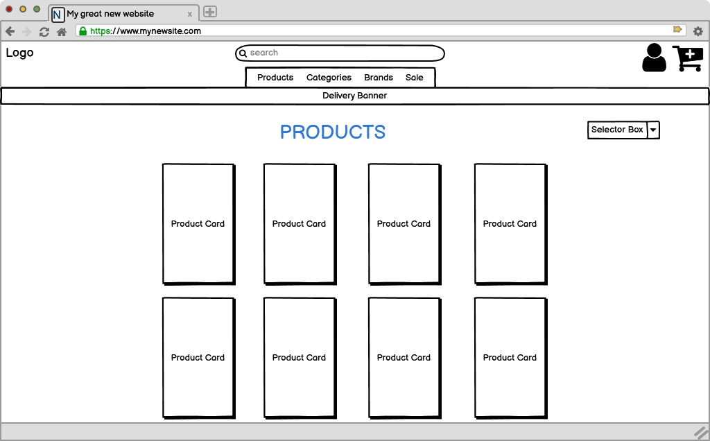
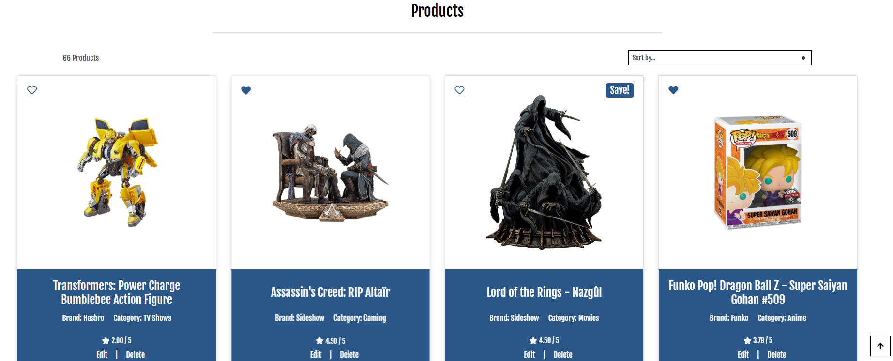
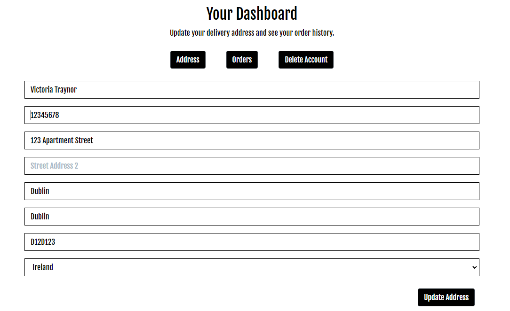

# LevelUp! Loot


Welcome to LevelUp! Loot. This website was built using Django, with custom Python, HTML and CSS for Code Institute P5 E-commerce Applications. This website is a B2C e-commerce application that allows users to purchase premium and exclusive collectible figures from across the realm of Pop Culture - including gaming, anime, TV show and movies.

The site has some features available exclusively to registered users, including viewing their order history, saving items to a wishlist and add product reviews.

Users have the ability to search products and view product details, add products to a cart and checkout. There is also a contact page for queries, a privacy policy and a page of FAQs.

[Live link to LevelUp! Loot](https://levelup-loot-vt.herokuapp.com/)


<br>

# Table of Contents

1. [UX](#ux)
2. [The Strategy Plane](#the-strategy-plane)
    * [Targeted Users](#targeted-users)
    * [Site Goals](#site-goals)
    * [Project Goals](#project-goals)
3. [Agile Planning](#agile-planning)
    * [User Stories](#user-stories)
    * [Epic Breakdowns](#epic-breakdowns)
4. [Skeleton Plane](#skeleton-plane)
    * [Wireframes](#wireframes)
    * [Database Schema](#database-schema) 
5. [The Scope Plane](#the-scope-plane)
6. [The Structure Plane](#the-structure-plane)
    * [Features](#features)
    * [Home Page](#home-page)
      * [Brands Section](#brands-section)
      * [Categories Section](#categories-section)
      * [Featured Products Section](#featured-products-section)
      * [Why Shop With Us Section](#why-shop-with-us-section)
      * [Footer](#footer)
    * [FAQs Page](#faqs-page)
    * [Contact Page](#contact-page)
    * [Pages Restricted to Login](#restricted-pages)
    * [Products](#products-page)
    * [Product Details](#product-details-page)
    * [Wishlist](#wishlist)
    * [My Profile](#profile-page)
    * [Cart Page](#cart-page)
    * [Checkout Page](#checkout-page)
    * [Admin Page](#admin-page)
    * [Future Features](#future-features)
7. [The Surface Plane](#the-surface-plane)
    * [Design](#design)
      * [Colour Scheme](#colour-scheme)
      * [Typography](#typography)
      * [Images](#images)
8. [Business Model](#business-model)
    * [Marketing Strategy](#marketing-strategy)
      * [Social Media Marketing](#social-media-marketing)
      * [Newsletter Marketing](#newsletter-marketing)
    * [SEO](#search-engine-optimization-seo)
      * [Keywords](#keywords)
      * [SiteMap](#sitemapxml)
      * [Robots](#robotstxt)
9. [Technologies](#technologies)
    * [Languages Used](#languages-used)
    * [Libraries And Frameworks](#libraries-and-frameworks)
    * [Tools and Resources](#tools-and-resources)
10. [Testing](#testing)
    * [Validator Testing](#validator-testing)
    * [Other Testing](#other-testing)
11. [Bugs Found and Fixed](#bugs-found-and-fixed)
    * [Bugs Not Fixed](#bugs-not-fixed)
12. [Credits And Sources](#credits-and-sources)
13. [Deployment](#deployment)
14. [Acknowledgements](#acknowledgements)

<br>

# UX

## The Strategy Plane

### Targeted Users

- A user that wants to view and buy collectible statues.
- A user that wants to see the latest statues released from major brands.
- A user that is interested in all things Pop Culture.

### Site Goals

- For users to be able to search products quickly and easily.
- For users to be able to purchase products quickly and easily.
- For users to be able to create an account to store their Wishlist and see their order history.
- For users to be able to edit their saved address for easier purchasing.
- For users to be able to contact the business online.

### Project Goals

- Create a fully working e-commerce application that would look and feel like a professionally designed online store. Taking all of my knowledge from the 4 projects before, I wanted this website to be as comprehensive and complete as I could possibly make it.
- In my previous projects, I had yet to write anything like a wishlist or user reviews so these were something I wanted to incorporate to further expand my knowledge of CRUD functionality.

<br>

[Back to Top](#table-of-contents)

<br>

## **Agile Planning**

My Project was developed with agile planning. This meant that each individual feature was split first into User Stories for what the user of the website would expect. Each User Story was thought about and planned out, which allowed me to create multiple tasks which would be developed to implement certain features and these Tasks were then grouped together into Epics.

Everything was labeled as Must Have, Should Have, Could Have and Won't Have to help prioritise which were most important to implement.

As the main priority of the website, the products section was started first and given the most time for completion. After that, as the project evolved, some more tasks were added or updated, based on the changing needs of a User within the website.

The Project board can be found [here](https://github.com/users/VictoriaT87/projects/6/views/1?visibleFields=%5B%22Title%22%2C%22Assignees%22%2C%22Status%22%2C%22Labels%22%5D).


[Back to Top](#table-of-contents)

<br>

## User Stories

* Users will:

  * Have the ability to view and purchase products quickly and easily.
  * Be able to use the website across all devices with responsive design.
  * Be able to create an account, update their profile information, leave reviews and create a wishlist.

* Users expect:

  * An easy to use e-commerce store, with purchasing of products going smoothly.
  * A website that looks well across all devices.
  * A website that works well, with minimum errors encountered.

<br>

[Back to Top](#table-of-contents)

<br>

## Epic Breakdowns
## **Epic 1: [Initial Install](https://github.com/VictoriaT87/level_up_loot_vt/issues/1)**
> Create the base Django application on which to build the project.

Broken down into these tasks:
- **Task: [Install Libraries and Frameworks](https://github.com/VictoriaT87/level_up_loot_vt/issues/10)**
>Install: Django, gunicorn, dj-database, psycopg2
- **Task: [Hide sensitive information](https://github.com/VictoriaT87/level_up_loot_vt/issues/11)**
> Hide sensitive information by creating an env.py file
- **Task: [Create Products app](https://github.com/VictoriaT87/level_up_loot_vt/issues/12)**
>  Create a products app to install the fixtures file
- **Task: [Create Fixtures File](https://github.com/VictoriaT87/level_up_loot_vt/issues/46)**
>  Create custom fixtures file for adding products

This Epic was the inital install of Django, gunicorn, dj-database and psycopg2 and the Products app. The custom fixtures file needed to add products into the store was then installed into this app. This was the base platform on which the entire website would be built.

[Back to Top](#table-of-contents)

<br>

---

<br>

## **Epic 2: [Initial Deployment](https://github.com/VictoriaT87/level_up_loot_vt/issues/2)**
> First deployment to the Heroku app once basic framework for the project is in place

Broken down into these tasks:
- **Task: [Heroku Deployment](https://github.com/VictoriaT87/level_up_loot_vt/issues/13)**
> Create App in Heroku, Create Config Var files, Deploy from main branch
- **Task: [ElephantSQL Set up](https://github.com/VictoriaT87/level_up_loot_vt/issues/14)**
>  Create Database URL in Elephant SQL, Add the Database URL to env.py and Heroku Config Vars

This Epic was for the inital deployment of the website to Heroku. This was undertaken as soon as the base packages, App and env.py file was set up and working correctly. Config Var files were created on Heroku for any sensitive information contained in the env.py file, as well as Port access needed.

[Back to Top](#table-of-contents)

<br>

---

<br>

## **Epic 3: [Databases](https://github.com/VictoriaT87/level_up_loot_vt/issues/3)**
> Create database models in project app and migrate them

Broken down into the following task:
- **Task: [Create and Migrate Database](https://github.com/VictoriaT87/level_up_loot_vt/issues/15)**
> Create and Migrate Database of products


The initial database was created for the products app and the installed products from the fixtures file. The database is hosted on ElephantSQL, so a project was started there to host it.

[Back to Top](#table-of-contents)

<br>

---

<br>

## **Epic 4: [Admin Panel](https://github.com/VictoriaT87/level_up_loot_vt/issues/4)**
> Add an admin panel to the project app to allow the admin to manage products

This was from the User Story:
#### **User Story: [Admin Panel](https://github.com/VictoriaT87/level_up_loot_vt/issues/16)**
> As a Site Admin I can use an admin panel so that I can create, update, manage and delete products and orders


The Admin panel allows the site admin to manage products - add, delete, update, set them to be on sale with discount prices or have them featured on the homepage. The admin panel also stores all contact form submissions and user profiles. All information for these can be seen, updated and removed from the database through the admin panel. Each App's admin.py file was also given some sort of display or search parameter, to make it easier for the site admin to find and sort information on the backend. 

[Back to Top](#table-of-contents)

<br>

---


## **Epic 5: [User Profiles](https://github.com/VictoriaT87/level_up_loot_vt/issues/5)**
> Allow Users to create/update/manage and delete user profiles

This was from the User Story:
#### **User Story: [Create a Profile](https://github.com/VictoriaT87/level_up_loot_vt/issues/17)**
> As a Site User I can create an account so that I can save my information for easier repeat purchases and to view my order history

Which was down broken down into these tasks:
- **Task: [Create Account](https://github.com/VictoriaT87/level_up_loot_vt/issues/18)**
> As a Site User I can create an account so that I can save my information for easier repeat purchases and to view my order history
- **Task: [Update Account](https://github.com/VictoriaT87/level_up_loot_vt/issues/19)**
> Allow a user to update all their profile information within their account and update database accordingly
- **Task: [Delete Account](https://github.com/VictoriaT87/level_up_loot_vt/issues/20)**
> Allow a user to delete their account, add authorisation so this isn't done by accident

<br>

This User Story was implemented with the use of the AllAuth package, as well as a Profile Model, Form and Template. The information the user enters in this is stored in the Admin panel, for SuperUsers/Staff to see and manage. Each User is assigned a User ID which allows for orders to be assigned properly to each individual. Users can edit their profiles and delete them and this is all reflected in the database.

[Back to Top](#table-of-contents)

<br>

---

<br>

## **Epic 6: [Adding Products to Cart](https://github.com/VictoriaT87/level_up_loot_vt/issues/6)**

> Create an app to allow users to view products and add them to a cart


This was from these User Stories:
#### **User Story: [View Products](https://github.com/VictoriaT87/level_up_loot_vt/issues/37)**
> As a user I can view products so that I can decide which items I want to purchase

#### **User Story: [Search Products](https://github.com/VictoriaT87/level_up_loot_vt/issues/38)**
> As a user I can search all products and view categories so that I can see only the products I'm interested in

#### **User Story: [View Product Details](https://github.com/VictoriaT87/level_up_loot_vt/issues/39)**
> As a user I can view individual product details so that I can identify the price, description, rating, image and price.

#### **User Story: [Identify Deals](https://github.com/VictoriaT87/level_up_loot_vt/issues/40)**
> As a user I can easily view deals and sales so that I can take advantage of savings on products I want to purchase

Which was down broken down into these tasks:
- **Task: [Create Products app](https://github.com/VictoriaT87/level_up_loot_vt/issues/12)**
>  Create a products app to install the fixtures file
- **Task: [Manage Products](https://github.com/VictoriaT87/level_up_loot_vt/issues/23)**
> Allow admins/superusers to add products to the store through the frontend or admin panel
- **Task: [Add/View Products](https://github.com/VictoriaT87/level_up_loot_vt/issues/24)**
> Create a Product app which will show all available products, with prices and ratings.
- **Task: [Update/Delete Products](https://github.com/VictoriaT87/level_up_loot_vt/issues/25)**
> Allow Site Admins to update and delete products available on the site
- **Task: [Add Sale Feature](https://github.com/VictoriaT87/level_up_loot_vt/issues/47)**
> Add the ability for an admin/superuser to add products to a sale list, with calculated discount, for users to view

These User Stories are the basis of the website. This adds the product app which allows Admins/Superusers to add products to the store, update or delete them, and publish them for Site Users to view. It also adds the Sale section which will allow Users to quickly view products that are on sale, which will entice more sales for discount prices. All products can be managed on both the frontend and the admin section, with everything reflected in the database.

[Back to Top](#table-of-contents)

<br>

---

<br>

## **Epic 7: [Purchasing Items](https://github.com/VictoriaT87/level_up_loot_vt/issues/7)**

> Allow users to purchase items in their cart

This was from these User Stories:
#### **User Story: [View Total Spending](https://github.com/VictoriaT87/level_up_loot_vt/issues/41)**
As a user I can easily see how much my total purchase will be so that I can avoid spending too much

#### **User Story: [View Items in Cart](https://github.com/VictoriaT87/level_up_loot_vt/issues/43)**
As a user I can view items in my bag to be purchased so that I can identify the total cost of my purchase and all the items I will receive

#### **User Story: [Safe and Secure Payment](https://github.com/VictoriaT87/level_up_loot_vt/issues/42)**
As a user I can feel that my payment is safe and secure so that I can confidently provide the needed information to make a purchase

Which was down broken down into these tasks:
- **Task: [Create Cart App](https://github.com/VictoriaT87/level_up_loot_vt/issues/48)**
> Create a cart app which will allow site users to view their cart, update it as they wish and see their current subtotal
- **Task: [Set up Stripe Payments](https://github.com/VictoriaT87/level_up_loot_vt/issues/49)**
> Set up webhooks to connect and allow Stripe payments on the website

This Epic was the breakdown of User Stories that will allow Site Users to add products to a cart, view the subtotals and checkout securely. Stripe was used for the Webhooks to handle payments. 

[Back to Top](#table-of-contents)

<br>

---

<br>

## **Epic 8: [Front End Design](https://github.com/VictoriaT87/level_up_loot_vt/issues/8)**

>Create templates, a colour scheme, navigation and responsiveness for the website

This was from the User Story:
#### **User Story: [Responsive Design](https://github.com/VictoriaT87/level_up_loot_vt/issues/21)**
> As a Site User I expect responsive elements so that I can view the website across multiple devices

Which was down broken down into these tasks:
- **Task: [Create Templates](https://github.com/VictoriaT87/level_up_loot_vt/issues/26)**
> Create templates for each page needed within the site, including the home page, a booking page, a login/create account page and pages for further information.
- **Task: [UI Design](https://github.com/VictoriaT87/level_up_loot_vt/issues/27)**
> Design a website fitting of the theme with appropriate colours, easy to navigate, easily accessible information and has full screen reader capabilities.

One of the most important parts of a website, the look and layout bring out emotions in the user. The website needs to be easy to navigate, while not feeling too cluttered with the many options for products to buy. The responsiveness of the website has been extensively tested, as documented in the testing section.

[Back to Top](#table-of-contents)

<br>

---

<br>

## **Epic 9: [Error Pages](https://github.com/VictoriaT87/level_up_loot_vt/issues/9)**

> Create custom error page templates for 404, 403 and 500 errors.

This was from the User Story:
#### **User Story: [Error Pages](https://github.com/VictoriaT87/level_up_loot_vt/issues/50)**
> As a user I can see custom error pages so that I can see exactly what my issue was and report it to the site admin if needed

Which was down broken down into these tasks:
- **Task: [404 Error Page](https://github.com/VictoriaT87/level_up_loot_vt/issues/29)**
> Add a custom 404 Page to show the user which error they encountered while keeping the base template and css of the website.
- **Task: [403 Error Page](https://github.com/VictoriaT87/level_up_loot_vt/issues/30)**
> Add a custom 403 Page to show the user which error they encountered while keeping the base template and css of the website.
- **Task: [500 Error Page](https://github.com/VictoriaT87/level_up_loot_vt/issues/31)**
> Add a custom 500 Page to show the user which error they encountered while keeping the base template and css of the website.

Creating custom error page templates makes the website feel more fleshed out. Before their implementation, they were provided as a basic white page with black text. Hopefully the user never sees these pages but in the event that they do, it's important that the page still looks individual to the website.

[Back to Top](#table-of-contents)

<br>

---

<br>

## **Epic 10: [Create Documentation](https://github.com/VictoriaT87/level_up_loot_vt/issues/51)**

>Create both a README.md file and a Testing.md file to show the process of creating the project

Which was down broken down into these tasks:
- **Task: [Create README.md](https://github.com/VictoriaT87/level_up_loot_vt/issues/34)**
> Create an app inside the Django project to allow users to book a yoga session
- **Task: [Create Testing.md](https://github.com/VictoriaT87/level_up_loot_vt/issues/35)**
> Create a full Testing.md document with all necessary information on how the project was manually/automatically tested.

Document everything needed for the process of developing and testing the website.

[Back to Top](#table-of-contents)

<br>

---

#### **Others**
- **Task: [Testing](https://github.com/VictoriaT87/level_up_loot_vt/issues/52)**
> Create manual and/or automated tests for a Full-Stack Web application using an MVC framework and related contemporary technologies

Automatic tests were written using TestCase from Django, as well as manual testing of code and resposivness. Covered in the Testing section.

- **Task: [Allow Email and Password Changing](https://github.com/VictoriaT87/level_up_loot_vt/issues/28)**
> Allow the User to reset both their passwords and their email addresses if they've forgotten either.

This is all handled through the AllAuth authentication system. Users who have forgotten their password have the option to have it emailed to them.

- **User Story: [Wishlists](https://github.com/VictoriaT87/level_up_loot_vt/issues/44)**
> As a user I can add products to a wishlist so that I can easily see which items I would like to buy eventually
- **Task: [Wishlist](https://github.com/VictoriaT87/level_up_loot_vt/issues/45)**
> Add an app with views/models/URLs to allow users to store a wishlist of products

These 2 tasks were added on later in the planning when I realised that the majority of e-commerce stores have some sort of wishlist/favourites section and as a user of those sites myself, I find this function very useful. Instead of having to return to the "All Products" section to find a certain product, allowing users to store their favourites in one place will make it more likely for them to return to purchase these items quickly.

<br>

[Back to Top](#table-of-contents)

<br>

## Skeleton Plane

### Wireframes

- My starting point for this project was to decide on a layout using a wireframe. I went for a Hero Image for the front page, to quickly show the user what the business was about at first view. The products page each has a card, showing all details quickly so users can easily see the product, the price and a quick description.


<br>



<br>

### Database Schema

- Both the AllAuth User and the Products Database are the main ones in the schema, connecting all products and profiles.
- The Products Database allows for a connection to the Checkout Databases, including the orders, order items and coupons.
- The Products Database also allows us to create a Wishlist for users. This is a ManyToMany database, which allows us to have 1 user wishlist as many products as they want.
- The Profile Database is separate from the User, so that users to the site don't need to have created an account to make an order but if they do, they can save their profile information for quicker checkout next time. 
- The Review Database is connected to the Profile Database - this means that registered users can leave a review for a product, as well as update and delete those reviews.
- The Contact Database is used purely for creating and storing Contact Form submissions on the admin panel for staff to view.


[Back to Top](#table-of-contents)

<br>

## The Scope Plane
- Home page with hero image that immediately tells the user what the site is for.
- Account registration which will allow for restricted viewing on Editing and Deleting reviews, wishlists and saving their information for quicker checkout next time.
- Fully responsive website, tested across all screen sizes, with navigation for mobile.
- Ability to create, view, update and delete reviews for users and products for superusers.

<br>

[Back to Top](#table-of-contents)

<br>

## The Structure Plane

# Features 

## Existing Features

### Home Page

- The home page features a hero image, with some text that show a product for sale. This lets the user know immediately what type of items are available.
- The index page is split into multiple sections, with the information easy to read and eye catching to a visitor.
- There is a button that links to the product details page.


<br>

[Back to Top](#table-of-contents)

<br>

### Brands Section

- The Brands section is a section of images which links to a search for each brand name.
- There is a hover effect on each image for larger screen sizes, which shows text with the name of each Brand. On mobile, this hover effect is the default.


<br>

[Back to Top](#table-of-contents)

<br>

### Categories Section

- The categories section is used to add more colour to the page. Each panel links to a search of categories. On mobile this section is condensed to a vertical view.


<br>

### Featured Products Section

- The Featured Products section will take a random list of 5 products that have been marked as "Is_Featured" on the admin panel.
- Each product has a card with it's details, price and if it's also on sale.

<br>

[Back to Top](#table-of-contents)

<br>

### Why Shop With Us Section

- The "Why Shop With Us" section gives users a quick summary of reasons to shop with this store.
- There are icons and a single line of text giving 3 quick reasons why a user would want to shop online - quick shipping, weekly rotation of products and no import fees are reasons why users would want to shop with an online store and also come back to shop again.

<br>

[Back to Top](#table-of-contents)

### Footer

- The footer is used across all pages, with links to Contact, FAQs, Privacy Policies and an email address.
- The footer also has our newsletter signup, generated through MailChimp. This makes it available across every page to maximise the chance of someone signing up.

<br>

[Back to Top](#table-of-contents)

<br>

### FAQs Page

- The FAQs page gives the user information about shipping, cancellations, order modifications and payment options.
- There is a link system at the top of the page to allow users to quickly get to the section they need.

<br>

[Back to Top](#table-of-contents)

<br>

### Contact Page

- The contact page features small icons with quick and easy to read information with a phone number, address and email.
- The page also hold a form for users to get in contact with the business. This form stores the posted information in the Admin panel, for staff to read easily.

<br>

[Back to Top](#table-of-contents)

<br>

### Restricted Pages


- Some pages are restricted to logged in users only. Links to these pages are only show in the Navbar when a user logged in.
- The Wishlist is exclusively for users who register an account.

<br>

[Back to Top](#table-of-contents)

<br>

### Products Page

- The Products Page lists all products initially.
- This can be changed by choosing a category or a brand from the drop down navbar menu or by using the Selector Box to sort items.
- Each individual product has a card with all details listed (rating, price, brand, category) and each card also has a hover effect.
- Each product can also be added to a logged in users wishlist if they click the heart icon.
- Clicking on the "View Product" button will bring the user to the product detail page for that item.

<br>

[Back to Top](#table-of-contents)

<br>

### Product Details Page

- The product detail page shows a larger product image, a description for the product, as well as allowing the user to add this product to their cart for the amount they want.
- The page also shows user left reviews, with the option for logged in users to leave their own.
- Reviews are able to be updated or deleted by the User who left them or by admin/superusers. This is all CRUD functionality.


<br>

[Back to Top](#table-of-contents)

<br>

### Wishlist Page

- The Wishlist page allows users to have a list of all the products they have added to their Wishlist, by clicking the heart icon on each product.
- On the Wishlist page, there is ashort summary of the product, as well as a link to the product detail page, which allows users to add it to their cart.
- The page also has a remove option, which allows users to remove product from their Wishlist - again this is done through CRUD functionality.

<br>

[Back to Top](#table-of-contents)

<br>

### Profile Page

- The Account Profile page has a tabbed dashboard which allows users to update their information - name and shipping address - which can be used for a quicker checkout process.
- This Profile page also shows the users Order History, which allows them to see the summary of all past purchases.
- On this dashboard, the user also has the option to delete their profile. This deletes all associated order histories and information. There is a separate page for deletion confirmation.


<br>

[Back to Top](#table-of-contents)

<br>

### Cart Page

- The cart page shows everything a user has in their cart currently.
- This page allows for updating quantities, deleting products from their cart and seeing details of each product.
- The subtotals are calculated automatically and if a product is on sale, it will show the original price of each item and the sale price.

<br>

[Back to Top](#table-of-contents)

<br>

### Checkout Page


- The checkout page shows the products, prices, a coupon section, includes a users information and a stripe element for secure card payments.
- The coupon code section allows a user to add a coupon code, which then shows how much of a discount the user will get, as well as their newly updated total price.
- On successful checkout, an order summary page is shown. This will include the discount if a coupon was used, and has a link to brows more products after.


<br>

[Back to Top](#table-of-contents)

<br>

### Admin Page

- The admin dashboard is restricted to Super Users and anyone the Super User designates as staff. The dashboard is populated with the information from the Models in each app.
- There is a section for products, wishlists, users, contact form submissions and orders.

- The Products section of the admin, allows for adding, removing and updating all products.
- There are also checkboxes to allow admins to update products as on_sale (with a default 10% off) and to be featured on the home page.

- The Contact form submissions are saved to the admin panel. The name, email and message from the contact form is shown to the admin, to allow them to reply to the User easily.

[Back to Top](#table-of-contents)

<br>

## Future Features

- There are a few features I would like to add to the website, given more time. Currently the product ratings are just random numbers entered when the product is being added (initally with a fixtures file) but I would like for users to also be able to add a product rating too which is caluclated as an average. 
- Currently, the coupons can be added any number of times - there is no limit for one use per customer. I tried to implement that to no success. More information about it can be found in the [Bugs Section](#bugs-not-fixed)

<br>

[Back to Top](#table-of-contents)


## The Surface Plane
## Design
### Colour Scheme
 -  The colour scheme was designed so that while it stands out as a bright interface, the colours also don't distract from the product images, as these are the main point of the website.
 - For this I chose a blue to stand out on the white background - they compliment each other well enough without one being overly distracting from the other.


### Typography
 -   The font chosen for the website is a font called Fjalla One. This was picked because it is very easy to read with a medium contrast but it also has a somewhat fantasy feel to it, in fitting with the expected user base of people who like Pop Culture. I wanted the typography to compliment the website, not overpower what it was saying. The font was found on [Google Font](https://fonts.google.com/specimen/Fjalla+One) and imported to the website with a CSS import.

### Images
- All product images were taken from their respective brands websites, as well as some from [Gamestop](https://www.gamestop.com/).

<br>

[Back to Top](#table-of-contents)

<br>

## **Business Model**

This website follows a Business to Customer model - it sells products related to Pop Culture directly to the customer. The website has been built for quick checkout for both registered and unregistered users, with extra features available to users who have signed up to the website, as well as users who subscribe to the newsletter.

[Back to Top](#table-of-contents)

## **Marketing Strategy**

### **Social Media Marketing**

A mockup design of a Facebook page is included. The main goal of this Facebook page would be to showcase new deals on products, give coupon code discounts to followers, and have targeted ads for different times of the year - "End of School Sale", "Christmas Sale", "New Season of X Show Starting Soon" etc.


### **Newsletter Marketing**

The website has an embedded [Mailchimp](https://mailchimp.com/?currency=EUR) newsletter in the footer, as well as a pop-up form for the first visit. The reason for both would be to allow users who return to sign up, even after they have dismissed the inital pop-up. The campaign sends out a custom thank you email with a discount code to encourage users to subscribe.

This newsletter can in turn be used by the site owner to send subscribers emails on the latest products, deals, and discounts available.


[Back to Top](#table-of-contents)

## **Search Engine Optimization (SEO)**

### **Keywords**

For finding meta keywords for the website, I used [Wordtracker](https://www.wordtracker.com/search). The keywords were chosen based on their performance and volume, as the competition stat wasn't show for the majority of the keywords.


### **Sitemap.xml**

I created a sitemap using [XML-Sitemaps](https://www.xml-sitemaps.com) on my live website [https://levelup-loot-vt.herokuapp.com/](https://levelup-loot-vt.herokuapp.com/)

The XML that was created is in the root directory of the website.

### **Robots.txt**

The robots.txt file was created using this guide [https://www.conductor.com/academy/robotstxt/](https://www.conductor.com/academy/robotstxt/).


[Back to top](#table-of-contents)

<br>

# Technologies

## Languages Used
* [HTML5](https://en.wikipedia.org/wiki/HTML5)
* [CSS3](https://en.wikipedia.org/wiki/Cascading_Style_Sheets)
* [Javascript](https://en.wikipedia.org/wiki/JavaScript)
* [Python](https://en.wikipedia.org/wiki/Python_(programming_language))

## Frameworks Used

* [Django](https://www.djangoproject.com/)
* [Bootstrap](https://blog.getbootstrap.com/) 

## Libraries And Installed Packages

* [coverage](https://pypi.org/project/django-coverage/) - Used for running automated tests.
* [pytest](https://docs.pytest.org/en/7.2.x/) - Used for running automated tests.
* [pytest-cov](https://pypi.org/project/pytest-cov/) - Used for running automated tests.
* [crispy-bootstrap4](https://pypi.org/project/crispy-bootstrap4/) - Template pack used for django-crispy-forms
* [django-crispy-forms](https://pypi.org/project/crispy-bootstrap4/) - Used to render forms throughout the project.
* [dj-database-url](https://pypi.org/project/dj-database-url/) - A package used to utilize DATABASE_URL environment variable.
* [dj3-cloudinary-storage](https://pypi.org/project/dj3-cloudinary-storage/) - Facilitates integration with Cloudinary by implementing Django Storage API.  
* [django-allauth](https://django-allauth.readthedocs.io/en/latest/) - Allows authentication, registration and account management in Django.
* [django-countries, v7.2.1](https://pypi.org/project/django-countries/7.2.1/) - Django application used to provide country choices for use with forms, and a country field for models.
* [gunicorn](https://gunicorn.org/) - A Python WSGI HTTP Server for UNIX.
* [psycopg2](https://pypi.org/project/psycopg2/) - A PostgreSQL database adapter.
* [boto3==1.26.27](https://pypi.org/project/boto3/) - An Amazon Web Services (AWS) software development kit (SDK) used to connect to the S3 bucket
* [Black](https://pypi.org/project/black/) - A Python code formatter.
* [django storages](https://django-storages.readthedocs.io/en/latest/) - Collection of custom storage backends for Django.
* [Css Minifier](https://www.toptal.com/developers/cssminifier) - Minify CSS for better response time.

<br>

[Back to Top](#table-of-contents)

<br>

## Tools And Resources
* [GitPod](https://www.gitpod.io/)
* [GitHub](https://github.com/)
* [Heroku](https://heroku.com)
* [ElephantSQL](https://www.elephantsql.com/)
* [Cloudinary](https://cloudinary.com/)
* [ReadMe Template](https://github.com/Code-Institute-Solutions/readme-template)
* [Stack Overflow](https://stackoverflow.com/)
* [Coolors](https://coolors.co/)
* [AmIResponsive](https://ui.dev/amiresponsive)
* [Real Python](https://realpython.com/)
* [Online Convert](https://image.online-convert.com/convert-to-webp)
* [Pic Resize](https://picresize.com/)
* [Sideshow](https://www.sideshow.com/)
* [Hasbro](https://shop.hasbro.com/)
* [Darkhorse](https://www.darkhorsedirect.com/)
* [Gamestop](https://www.gamestop.com/)

<br>

[Back to Top](#table-of-contents)

<br>

# Testing 
### Validator Testing 

- HTML
  - No errors were returned when passing through the official [W3C validator](https://validator.w3.org/)
  - The only warnings that were given were because of the nature of Django Template Syntax.

- CSS
  - No errors were found when passing through the official [(Jigsaw) validator](https://jigsaw.w3.org/css-validator/)
  
- Python
  - No errors were returned when passing through [CI Python Linter](https://pep8ci.herokuapp.com/)
  - The only issue that was brought up by the Linter were some lines too long. As these were less than 5 characters and that code had already been formatted by the Black plugin, I left these alone.

<br>

### Lighthouse Testing
#### Desktop

- Testing on desktop initially resulted in a low Accessibility score of 87. This was due to the insufficient contrast ratio of the blue color I had originally chosen.
- To address this issue, I used a color contrast checker in Lighthouse and discovered that I needed to change the blue color to a darker shade.
- I also checked the colors used in the Categories section and realized that I needed to improve the contrast there as well. To resolve this, I added a drop shadow effect to the text.
- After implementing these fixes, the updated metrics showed significant improvements: 99 Performance, 98 Accessibility, 92 Best Practices, and 100 SEO.

- 
- 

<br>

#### Mobile

- On mobile, the performance score is 93. Initially, it was lower due to a cumulative layout shift (CLS) of 0.219. To address this, recommendations were provided to add width and height attributes to images and convert the images from .jpg to .webp format.
- To convert the images from .jpg to .webp, I used the [WEBP Converter](https://cloudconvert.com/webp-converter) website.
- Additionally, I changed the background image on the Hero section of the index page to a smaller version in order to mitigate the CLS issue.
- The main challenges with achieving a higher rating are related to Lighthouse's recommendation to use HTTP2, which is not within my control as the website is hosted on Heroku.
- There is also an issue related to "Reduced unused JavaScript," which specifically mentions Stripe, AWS, Mailchimp, and jQuery. Since these libraries are included in the base template and separating them would require significant time and effort, I have chosen to leave them as they are and provide screenshots as evidence.


| Page | Device | Category | Result |
|------|--------|----------|--------|
|Index | Mobile | Performance | 93% |
|||Accessibility| 98% |
|||Best Practice | 92% |
|||SEO | 100% |
|| Desktop | Performance | 100% |
||| Accessibility | 98% |
||| Best Practice | 92% |
||| SEO | 100% |
 <br>

 [Back to Top](#table-of-contents)

<br>

### Automated Testing
- I wrote tests for each app and for every view.py, model.py and form.py I have in the project. Below is the coverage report. Since my last project I have taken a keen interest in learning more about automated testing. Linked below are some of the resources I used to help me learn. Although the test still aren't comprehensive as I'd like and there are unfortunately some apps that I didn't even know how to begin to tackle (or if I should), I still managed to write 81 tests that all pass.

- For the SetUp methods, based on the video linked below from Adam Johnson, I used the class method. However, as I had previously learned to use the SetUp method, I reverted back to that as I didn't know the difference between the 2 versions and didn't want t confuse the code by having multiple ways for the same thing. 

#### Resources Used For Testing
- [DjangoCon 2021 | Speed up your tests with setUpTestData | Adam Johnson](https://www.youtube.com/watch?v=_8qLxaWMdzE)
- [Mozilla | Django Tutorial Part 10: Testing a Django web application](https://developer.mozilla.org/en-US/docs/Learn/Server-side/Django/Testing)
- [https://machinelearningmastery.com/ | A Gentle Introduction to Unit Testing in Python](https://machinelearningmastery.com/a-gentle-introduction-to-unit-testing-in-python/)
- [Real Python | Getting Started With Testing in Python](https://realpython.com/python-testing/)
- [DataQuest | A Beginner’s Guide to Unit Tests in Python (2023)](https://www.dataquest.io/blog/unit-tests-python/)

<br>


 

<br>

### Manual Testing
- Manual testing has been done extensively and has been shown in separate file, located [here.](documentation/testing.md)

### Other Testing
 - The website has been tested across various screen sizes, using the Chrome DevTools responsive device section, [Responsive Design Checker](https://responsivedesignchecker.com/) and by opening the website on Firefox, Chrome, 3 various sized Android phones (Huawei P20 Lite, OnePlus 9 Pro, Samsung Galaxy S20) and an Android tablet (Samsung Galaxy Tab 10). 
 - Here is a link to a separate [Markdown file](documentation/tested-devices.md) of device screenshots.

<br>

[Back to Top](#table-of-contents)

<br>

# Bugs

Below is a description of bugs encountered and how I was able to fix them or why I couldn't.

### Adding a blank quantity would throw a 500 error

  - #### Issue:

    - When Adding or Updating Products, if the quantity was blank or an empty string, a 500 server error would be thrown

  - #### Fix:

    - Initially I googled this and thought I might need to update the quantity_input_script.html to check for NaN (Not a Number). However, this seemed like it would be quite involved and I didn't think I would be able to make it work.
    - I then decided to check in the views for a validation. My views for add_to_cart and adjust_cart were updated with form validation and this works. The website now shows an error toast message if the quantity is blank.


<br>

### Adding an incorrect SKU throws a server error

  - #### Issue:

    - When Adding or Updating Products, the SKU could be any combination of letters or numbers and any length - resulting an error on form submission

  - #### Fix:

    - My inital thought was to add help-text to the model so that the form would tell the user what to write in the code. However, this didn't solve the issue that someone could intentionally or unintentionally still add an incorrect SKU and cause the same failure.
    - I then decided to have a SKU automatically generated when a new product was being added. This field pre-populates with a 6 digit code and is always unique. On top of that, I also made the field Read-Only on the Product Form, therefore it doesn't need to be touched by the admin and can't cause an issue.

 

<br>

[Back to Top](#table-of-contents)

<br>

  ### Delete Modal Not Deleting Correct Product ID

  - #### Issue:

    - When clicking on "Delete" on the all products page, the product ID for deletion would only point to the first product ID.

  - #### Fix:

    - This fix was actually quite easy in the end but it wasn't spotted for a long time, so thank you to [Sean Finn](https://github.com/seanf316/) my classmate for finding it.
    - The product cards on the product page were being rendered with a loop - , however I originally had the modal for deletion outside the loop. Therefore it rendered for the first product only. Moving the deletion modal into the loop, made sure that when clicking Delete, it was for the correct Product ID.

 

<br>

[Back to Top](#table-of-contents)

<br>

### User Editing and Deletion

  - #### Issue:

    - Any logged in user was able to delete another users profile by changing the URL PK number to another.

  - #### Fix:

    - This was a bug pointed out to me by a fellow student [Sean Johnston](https://github.com/seanj06/). I wouldn't have known to look for it myself so I'm very thankful.
    - I had LoginRequired Mixins on my edit and delete views for both appointments and profiles, however I didn't realise that would allow _any_ logged in user access to a different users account just by changing the PK in the URL for edit/delete.
    - Sean pointed me towards the UserPassesTestMixin and I was successfully able to implement this into my Views. Users now need to pass an ID check before they're allowed to access the Edit or Delete views for their own profile and they get a 403 Forbidden page if they try to access a different users profile.

<br>

[Back to Top](#table-of-contents)

<br>

### Reviews Can Be Updated By Any User, Multiple Reviews Allowed 

  - #### Issue:

    - Any user can update any other users review by changing the review ID in the update URL. Also, multiple reviews could be submitted by a user for the same product.

  - #### Fix:

    - I used CBVs for my Review forms - to allow updating and deleting. However, I originally only had the LoginRequiredMixin on these.
    - I needed to add the UserPassesTestMixin to these CBVs, so that only the original auther of the reviews could update or delete their own review.
    - For the reviews being 1 per user - I found this article on [StackOverflow](https://stackoverflow.com/questions/68135234/how-to-allow-users-to-rate-a-product-only-once), which allowed me to a UnqiueContraint to the review model.

<br>

[Back to Top](#table-of-contents)

<br>

### Wishlists

  - #### Issue:

    - The Wishlist would only allow 1 product to be added per user.

  - #### Fix:

    - The most trouble I had with this project seemed to be with the Wishlist. This particular issue was more to do with a misunderstanding of my models.
    - The original model I created for the wishlist used a ForiegnKey for both the user and the product. This meant that I could add 1 product to 1 user's Wishlist.
    - I also had an issue where a newly registered user would not have a Wishlist automatically created on account creation - so when that user tried to add a product to a wishlist, this would throw an error as a wishlist didn't exist. I originally thought to create a signal that would create the Wishlist, the same way the UserProfile would be created, however this seemed like it was an overcomplication of the issue.
    - To fix everything, I had a complete re-write of the Wishlist app. I changed the model from ForeignKeys to a ManyToManyField key for Products and a OneToOneField for the User.
    - For the views, I found these articles - [Django Docs](https://docs.djangoproject.com/en/4.2/ref/models/querysets/#get-or-create) and [https://www.queworx.com/django/django-get_or_create/](https://www.queworx.com/django/django-get_or_create/) - which would allow me to get_or_create a Wishlist for a user. Alongside the Try and Except statements, this would handle any error that might be created if a user did not currently have a Wishlist associated with their account ID.
    - However, on the actual template then, this was giving me the error "AttributeError::: 'tuple' object has no attribute 'products'" when trying to iterate over the Wishlist with  and .
    - I realised the get_or_create was creating a tuple, so I couldn't iterate over it with just the  syntax - I needed to check if the wishlist exists with products first and then I needed to access the products on the wishlist. This lead me to try  and  which worked. This - to my knowledge - was because the Wishlist itself was only a type of holder for many products. The wishlist itelf was 1 item - the products were what we needed to access.
    - I feel there was probably an easier way to achieve the same outcome - but this solution worked for me, it's being saved properly to the database and so was fit for purpose here.


<br>

[Back to Top](#table-of-contents)

<br>

# Bugs Not Fixed

### Coupon Codes

  - #### Issue:

    - Coupon codes can be used multiple times per user.

  - #### What I Tried:

    - For coupons, I only wanted a user to be able to use a coupon once and then they couldn't use it again on a new order but I couldn't get this to work.
    - I tried this from [StackOverflow](https://stackoverflow.com/questions/62359009/django-how-to-reduce-total-number-of-coupons-after-each-use) with my code being:
    ```
    def add_coupon(request):
    """ Allow a user to add the coupon code """

    code = request.POST.get('code')
    order = Order.objects.filter(user_profile__user=request.user).order_by('-date').first()
    now = timezone.now()
    coupon = Coupon.objects.filter(code__iexact=code, start_date__lte=now, expiry_date__gte=now).exclude(order=order, max_value__lte=F('used')).first()
    
    if not coupon:
        messages.error(request, 'You can\'t use the same coupon again, or the coupon does not exist')
        return redirect('checkout')
    else:
        try:
            coupon.used += 1
            coupon.save()
            order.coupon = coupon
            order.save()
            messages.success(request, "Successfully added the coupon")
        except Exception:
            messages.error(request, "Max level exceeded for the coupon")
        
        return redirect('checkout')

    ```
    - However I was unable to get this to work properly and so for time purposes, I just allowed the coupon code to stay as it is. If this was a project going into a real production, this would be a bug that would be a priority to fix.

<br>

### Submit button on contact form

  - #### Issue:

    - Have the Submit button dissapear from the contact form once submitted.

  - #### What I Tried: 

    - I would like the contact form to completely disappear on submission, instead of just the Submit button being left behind. This is something I looked into but adding an onclick through HTML/CSS wouldn't work because the button would still disappear if the form failed to send. This would mean the user needs to refresh the page to get the submit button to reappear.
    - I then tried to add javascript for a button click event but this prevented the submission message from being displayed after the successful submission. Adding javascript to hide the button on submission, would hide it when the form was invalid but still show it when the page rendered the success message.

<br>

### Whitespace Validation on Contact Form

- #### Issue:

    - Could not achieve full whitespace validation for forms.

- #### What I Tried: 

  - The contact form currently allows users to submit messages that aren't stripped, e.g "C C C". Looking into this, I found some answers which were to set the model fields to have "blank=False" and "null=False" but this didn't work. I then tried to clean the data on the field using the clean() method but again, this didn't work. [Trim whitespaces from charField](https://stackoverflow.com/questions/5043012/django-trim-whitespaces-from-charfield)
  - The fields do all have to be filled in or the form will fail to send with an error message explaing all fields must be filled in, this was the best I could achieve for the form currently.

<br>

[Back to Top](#table-of-contents)

<br>

# Credits and Sources

### Wishlist
- Getting the Wishlist system to worked needed several tutorials and articles:
  - [stackoverflow.com - How to implement Add to WishList for a Product in Django?](https://stackoverflow.com/questions/56580696/how-to-implement-add-to-wishlist-for-a-product-in-django)
  - [stackoverflow.com - Filter in the template if the product is in wishlist or no. Django ecommerce website](https://stackoverflow.com/questions/71248375/filter-in-the-template-if-the-product-is-in-wishlist-or-no-django-ecommerce-web)
  - [Very Academy YouTube - Creating a User Bookmark / Favourites Features](https://www.youtube.com/watch?v=H4QPHLmsZMU)
  - [thenewboston Youtube - Django Tutorial for Beginners - Favorite View Function](https://www.youtube.com/watch?v=irH98-4eKmQ)
  - [stackoverflow.com - Add products to favorite list](https://stackoverflow.com/questions/67493992/django-add-products-to-favorite-list)
  - [Trying to redirect the wishlist after product deletion - not implemented](https://forum.djangoproject.com/t/redirecting-user-to-page-after-login/14603/9)
  - [codemy YouTube - How To Modify The Django Admin Area](https://www.youtube.com/watch?v=_7Fi9dpw-ew)
  - [StackOverflow - Django Admin ManyToManyField](https://stackoverflow.com/questions/8043881/django-admin-manytomanyfield)
  - [earthly.dev - Customizing the Django Admin](https://earthly.dev/blog/customize-django-admin-site/)
  - [Django Docs - ModelAdmin.filter_horizontal](https://docs.djangoproject.com/en/4.2/ref/contrib/admin/#django.contrib.admin.ModelAdmin.filter_horizontal)

<br>

### Coupon Codes
- [Packt YouTube - Django by Example : Creating a Coupon System](https://www.youtube.com/watch?v=_dSCGMJcoe4)
- [freecodecamp.org Youtube - How to Build an E-commerce Website with Django and Python](https://www.youtube.com/watch?v=YZvRrldjf1Y)
- [Nabil Moiun YouTube - Django Ecommerce Website | Add Coupon Code p1](https://www.youtube.com/watch?v=HFx6pVGxeys)

<br>

### Testing Credits
- [Freecodecamp.org, An Introduction to Unit Testing in Python](https://www.freecodecamp.org/news/an-introduction-to-testing-in-python) 
- [Real Python.com, Getting Started With Testing in Python](https://realpython.com/python-testing/)
- [Real Python.com, Testing in Django (Part 1) – Best Practices and Examples](https://realpython.com/testing-in-django-part-1-best-practices-and-examples/)
- [Real Python.com, Effective Python Testing With Pytest](https://realpython.com/pytest-python-testing/)
- [valentinog.com, Django Testing Cheat Sheet](https://www.valentinog.com/blog/testing-django/)
- [developer.mozilla.org, Django Tutorial Part 10: Testing a Django web application](https://developer.mozilla.org/en-US/docs/Learn/Server-side/Django/Testing)
- [adamj.eu, How to Unit Test a Django Form](https://adamj.eu/tech/2020/06/15/how-to-unit-test-a-django-form/)
- [Django Documentation, Advanced testing topics](https://docs.djangoproject.com/en/4.1/topics/testing/advanced)
- [Django Documentation, Testing tools](https://docs.djangoproject.com/en/4.1/topics/testing/tools/)
- [Stackoverflow.com, How to test django model method __str__()](https://stackoverflow.com/questions/29077509/how-to-test-django-model-method-str)
- [Stackoverflow.com, How can I unit test django messages?](https://stackoverflow.com/questions/2897609/how-can-i-unit-test-django-messages)
- [Stackoverflow.com, Django how to test model functions with validator](https://stackoverflow.com/questions/67331863/django-how-to-test-model-functions-with-validator)
- [Stackoverflow.com, Is it possible exclude test directories from coverage.py reports?](https://stackoverflow.com/questions/1628996/is-it-possible-exclude-test-directories-from-coverage-py-reports)
- [DjangoCon 2021 | Speed up your tests with setUpTestData | Adam Johnson](https://www.youtube.com/watch?v=_8qLxaWMdzE)
- [A Gentle Introduction to Unit Testing in Python](https://machinelearningmastery.com/a-gentle-introduction-to-unit-testing-in-python/)
- [A Beginner’s Guide to Unit Tests in Python (2023)](https://www.dataquest.io/blog/unit-tests-python/)
- [Django Testing - check messages for a view that redirects](https://stackoverflow.com/questions/16143149/django-testing-check-messages-for-a-view-that-redirects)
- [StackOverflow - Django testing model with ImageField](https://stackoverflow.com/questions/26298821/django-testing-model-with-imagefield)

<br>

### General Credits
- [Geeks For Geeks, UpdateView – Class Based Views Django](https://www.geeksforgeeks.org/updateview-class-based-views-django/)
- [Geeks For Geeks, Update View – Function based Views Django](https://www.geeksforgeeks.org/update-view-function-based-views-django/)
- [Stackoverflow.com, How to validate in UpdateView without validating through a form?](https://stackoverflow.com/questions/54319706/how-to-validate-in-updateview-without-validating-through-a-form)
- [Django Documentation, Using mixins with class-based views](https://docs.djangoproject.com/en/4.1/topics/class-based-views/mixins/)
- [Django Documentation, Using the Django authentication system](https://docs.djangoproject.com/en/4.1/topics/auth/default/)
- [Django Documentation, Form handling with class-based views](https://docs.djangoproject.com/en/4.1/topics/class-based-views/generic-editing/)
- [How to Disable Links - for Dropdown Menus](https://css-tricks.com/how-to-disable-links/)
- [Bootstrap navbar dropdown with hover effect](https://bootstrap-menu.com/detail-basic-hover.html)
- [StackOverflow - How to add a unique randomly generated 6 digit key stored in a model](https://stackoverflow.com/questions/64850945/how-to-add-a-unique-randomly-generated-6-digit-key-stored-in-a-model)
- [StackOverflow - Delete Modal Loop Fix](https://stackoverflow.com/questions/66116509/bootstrap-modal-is-not-working-with-for-in-jinja-2)
- [Dynamic page titles in Django](https://www.forgepackages.com/guides/page-titles/)
- [CodePen for Card Hover Effect](https://codepen.io/Corsurath/pen/abbxNpj)
- [Color Contrast Picker for Lighthouse Error](https://dequeuniversity.com/rules/axe/4.6/color-contrast)
- [StackOverflow - Static Root Deployment Error Fix](https://stackoverflow.com/questions/48455469/youre-using-the-staticfiles-app-without-having-set-the-static-root-setting-to-a)
- [StackOverflow - Calculate On Sale Discount](https://stackoverflow.com/questions/73813646/django-models-to-calculate-discount)
- [Code with Stein YouTube - Used for Related Products](https://www.youtube.com/watch?v=-Zqfzl9ovAw)
- [W3Schools - Image Hover Overlay for Brands](https://www.w3schools.com/howto/howto_css_image_overlay.asp)
- [W3Schools - Float Examples for Categories](https://www.w3schools.com/css/css_float_examples.asp)
- [StackOverflow - How can I make a link inside a div fill the entire space inside the div?](https://stackoverflow.com/questions/16555644/how-can-i-make-a-link-inside-a-div-fill-the-entire-space-inside-the-div)


<br>

[Back to Top](#table-of-contents)

<br>

# Deployment

Please refer to [DEPLOYMENT.md](documentation/deployment.md) file:

<br>

The live link can be found here - [LevelUp! Loot](https://levelup-loot-vt.herokuapp.com/)

<br>

[Back to Top](#table-of-contents)

<br>

# Acknowledgements
- To my amazing boyfriend Thomas. For listening to me worry about this project for months, for keeping me sane, for helping me switch off after a long day with a cup of coffee and a bar of chocolate :)
- My family and my cats for keeping my stress levels under control!
- [Sean Johnston](https://github.com/seanj06/) and [Sean Finn](https://github.com/seanf316/), my fellow classmates on Slack. Your help with my many questions was super appreciated, thank you.

<br>

[Back to Top](#table-of-contents)